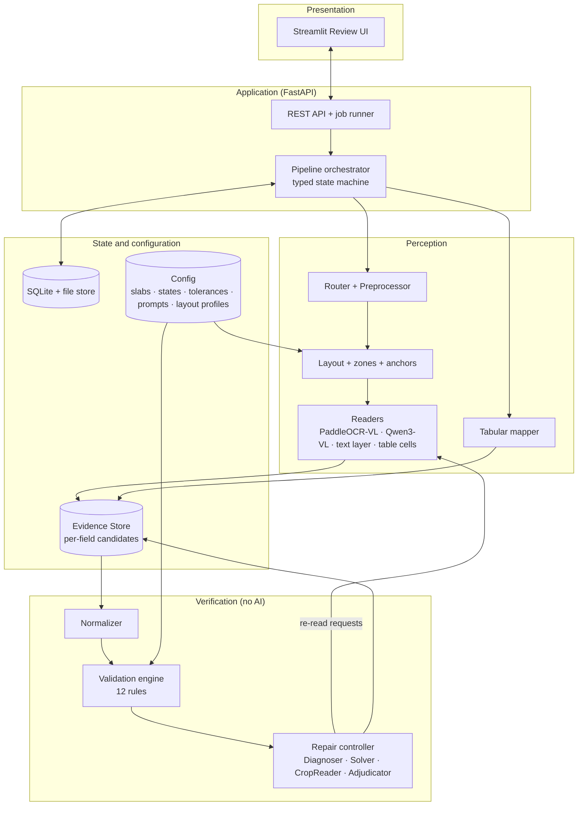
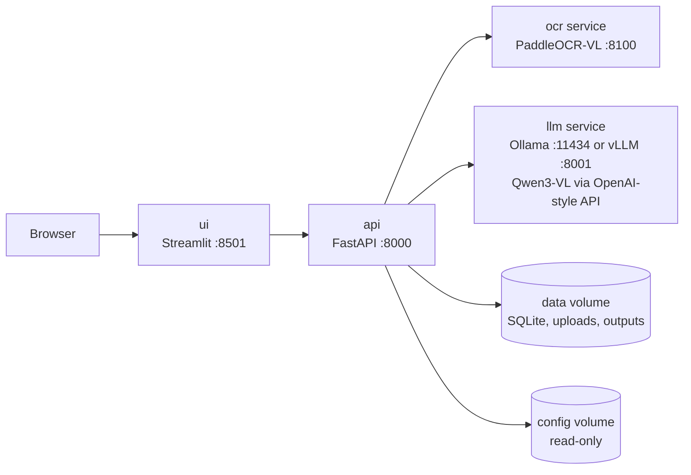

# GSTLens — ARCHITECTURE

> *Perception proposes. Arithmetic disposes.*
> Companion to the qualifier README. **Internal build blueprint for the final hackathon (10 Oct).**
> Files in this set: **ARCHITECTURE** (this) · [IMPLEMENTATION](IMPLEMENTATION.md) · [DESIGN](DESIGN.md) · [WORKING](WORKING.md)

> [!WARNING]
> The qualifier repository must contain **only `README.md`**. Do **not** commit these four files to it. Keep them in a private folder or a separate private repo, and use them from the final onward.

**Reality rule used throughout:** anything we have not run ourselves is marked **VERIFY@M0** (checked in the first 45 minutes of the final). Numbers labelled *budget* are design limits to be measured, not performance claims.

---

## 1. Constraints that shape every decision

| Constraint | Consequence for the design |
|---|---|
| One final day (nominal 10 h), 4 people | Few moving parts: one repo, one language (Python), no message broker, no database server |
| One consumer-class GPU (target 12–16 GB), possibly less | Small models only; two model servers must share the GPU; everything has a smaller fallback |
| Fully offline, financial data | No external API calls; no invoice content in logs; uploads purged on a timer |
| No labelled dataset supplied | We author ground truth by construction (synthetic + team-written invoices) |
| A wrong number is worse than a missing one | Every field has a verdict; unproven fields are flagged; repair never overwrites without evidence |
| Model releases move fast | All models sit behind a `Reader` interface; a bake-off at M0 chooses the pair |

---

## 2. Logical architecture



**The one idea that makes it work:** the **Evidence Store**. Every reader writes *candidates* (value, reader, view, location, optional log-probability) per field, never "the answer". The Normalizer and Validation Engine look at the best candidate; the Repair Controller looks at *all* candidates and at which rules each field participates in. Without it, repair is guesswork.

| Layer | Owns | Never does |
|---|---|---|
| Presentation | Rendering, user edits, polling | Business rules, validation |
| Application | Jobs, persistence, export, API | Reading pixels |
| Perception | Producing candidates with locations | Deciding if a value is correct |
| Verification | Rules, repair decisions, status | Calling a model directly (it *requests* re-reads) |
| State/config | Evidence, jobs, versioned rule tables | Logic |

---

## 3. Runtime topology and deployment



| Service | What runs | Why separate |
|---|---|---|
| `ui` | Streamlit | Restartable without touching inference |
| `api` | FastAPI, orchestrator, validation, repair, exporters (CPU only) | Holds all logic; stateless apart from the data volume |
| `ocr` | PaddleOCR-VL behind a small HTTP wrapper | **Paddle's framework dependencies commonly conflict with the PyTorch/vLLM stack**, so it gets its own container. VERIFY@M0 whether to run it through the Paddle pipeline or an upstream-documented vLLM/llama.cpp route |
| `llm` | Ollama (default) or vLLM serving Qwen3-VL (Instruct, non-thinking variant) | Both expose an OpenAI-style HTTP API, so `api` is runtime-agnostic. Ollama for laptops and quick start; vLLM only if the box is Linux + NVIDIA and M0 shows a benefit |

**GPU budget (indicative, measure at M0):** PaddleOCR-VL ≈ 2–4 GB; Qwen3-VL-8B 4-bit GGUF weights ≈ 6 GB (4B ≈ 3.3 GB) plus KV cache and image tokens. A 16 GB GPU fits both; 8–12 GB uses the 4B model. Docker GPU access needs the NVIDIA Container Toolkit on the host; on Windows/macOS dev machines, run Ollama natively and point `api` at the host.

**Plan B ladder (decided at gate G1):**

| Failure at M0 | Fallback | Cost |
|---|---|---|
| PaddleOCR-VL will not start in 30 min | Docling (MIT) for layout/tables/printed text | Weaker handwriting-zone detection; more reliance on OpenCV grid detection |
| Docling also fails | Qwen3-VL does layout/printed reads too (single-model mode) | Slower; more hallucination risk on dense tables, so rules matter more |
| Qwen3-VL-8B does not fit/too slow | Qwen3-VL-4B | Lower read accuracy → more flags, same architecture |
| Both models unusable on available hardware | Digital PDF + Excel/CSV + printed paths on CPU; handwriting shown as flag-only with side-by-side crop | Demo shrinks honestly; no fake results |

---

## 4. Component specifications

### 4.1 Input Router
| | |
|---|---|
| **In → Out** | Uploaded file → `(kind, per-page route)` |
| **Typing** | Magic bytes decide, not the extension: `%PDF-` → PDF; PNG/JPEG signatures → image; ZIP signature + `xl/` entries → XLSX; otherwise text → CSV (encoding via charset detection, delimiter via sniffing). Extension disagreement → re-type with a UI warning |
| **PDF page test** | A page is **digital** if it has ≥ 50 text characters *and* no single image covers > 85% of the page. A page dominated by a full-page image is **scanned** even if a hidden OCR text layer exists; that layer is kept as an *extra candidate* (`text_layer`) rather than trusted |
| **Limits (config)** | 25 MB/file, 30 pages/PDF, images downscaled to ≤ 3000 px on the long side for processing |
| **Failure** | Corrupt/encrypted file → job marked `rejected` with a plain-language reason; never crashes the batch |

### 4.2 Preprocessor (image pages only)
EXIF transpose → orientation fix (use the layout model's orientation output if available; manual rotate control in the UI otherwise; VERIFY@M0) → deskew (text-pixel angle estimate, applied only above ~0.5°) → perspective correction (largest paper-like quadrilateral; applied only if it covers > 50% of the frame, else skipped) → produce three views: **colour original**, **grey contrast-normalised**, **upscaled**. Output a **quality score q ∈ [0,1]** from sharpness (Laplacian variance), resolution (short side vs ~1200 px), contrast spread and residual skew. Low q never blocks processing; it lowers confidence and shows a "retake photo" hint.

### 4.3 Layout, zones and anchors
1. The layout model returns blocks (type, text, box, order) and, where supported, line-level text with boxes (PaddleOCR-VL 1.5 adds text spotting; VERIFY@M0).
2. **Anchor matching:** printed labels (`GSTIN`, `Invoice No`, `Date`, `Qty`, `Rate`, `Taxable`, `CGST`, `SGST`, `IGST`, `Total`, `Rupees`…) are matched by fuzzy string similarity against a synonym list in config.
3. **Zones:** header, parties, item table, totals, footer (amount in words, signature).
4. **Value-cell location:** the box to the right of / below an anchor, bounded by the next anchor or zone edge.
5. **Table grid:** ruled-line detection (OpenCV morphology) → cell boxes. Fallback when lines are faint: cluster text boxes by x-position under the header anchors.
6. **Layout profiles (template-first):** for the 1–2 bill-book layouts in our test set, a YAML profile pins anchors, fill areas and column fractions. Generic detection is the stretch; profiles guarantee a working handwritten demo.

### 4.4 Readers
```
Reader.read_field(crop, kind, view) -> Candidate
kind ∈ {digits, amount, gstin, date, text, invoice_no, hsn}
```
| Reader | Used for | Notes |
|---|---|---|
| `text_layer` | Digital PDF words (pdfplumber) | Exact; no model |
| `table_cell` | Digital PDF / Excel cells | Exact; no model |
| `paddle_vl` | Printed blocks, tables, anchors | Cheap first pass on all image pages |
| `qwen_vl` | Handwritten crops, row strips, second opinions | Field-typed prompt; **schema-constrained** output `{value, legible}`; may answer `legible:false` (abstain) instead of guessing |

**Cheap-first routing on image pages:** `paddle_vl` reads everything. A cell goes to `qwen_vl` if (a) its handwriting score is high (low printed-OCR confidence + irregular baseline/stroke width; heuristic, tuned at M3) or (b) it is a Tier A field on a page classified handwritten. A page is *handwritten* when ≥ 30% of value cells score high. Critical fields on handwritten pages are read **twice** (two models or two views). Printed pages use a second read only on rule failure.

**Confidence signals:** constrained decoding *forces format-valid output even when the model is unsure*, so output text is never taken as evidence of certainty. Signals are agreement, token log-probabilities **if the serving stack exposes them** (vLLM does; check the installed Ollama version, VERIFY@M0), and constraint support (§7).

### 4.5 Structurer and Normalizer
- **Table rows:** read each row as a strip with a constrained array-of-N-strings schema (N = mapped columns); cell-level crops are requested only during repair. Printed tables come as HTML/markdown from the layout model and are parsed deterministically.
- **Column mapping for printed headers:** synonym dictionary + fuzzy match; LLM only for unmapped headers.
- **Free text blocks** (buyer address etc.): LLM with JSON-schema constrained decoding.
- **Normalizer (deterministic):** money → `Decimal`; strips `₹`, `Rs`, `INR`, Indian digit grouping (1,00,000), trailing `/-`, parenthesised negatives; dates → ISO with day-first preference and cross-check against other dates on the page; Excel serial dates; state names ↔ codes; units.

### 4.6 Tabular pipeline (Excel/CSV)
Header-row detection (first row with the most text cells followed by mostly numeric rows) → unmerge and forward-fill merged cells → **value profiling** per column (does it look like GSTIN / date / money / HSN?) → map: synonym match, then value profile, then LLM on header + 5 sample values for the remainder → low-confidence mappings appear in the UI for one-click confirmation → group rows into invoices (invoice number + supplier) → same canonical schema and Validation Engine. **Lossless:** unmapped source columns are preserved in an `extra` object. Pitfalls handled on purpose: formulas without cached values (read cached values; if absent, flag), leading zeros in HSN (all cells read as strings), `dd/mm` vs `mm/dd` ambiguity.
**Layouts supported:** one-row-per-line-item (P0), one-row-per-invoice (P0), invoice laid out as a form in cells (P1 only if time).

### 4.7 Validation Engine (pure Python, no I/O)
Specified in §6. Each rule returns `RuleResult` objects that name the implicated fields and, where it can compute them, **expected values** (e.g. "taxable should be 5,400"). The engine also builds the **field↔rule incidence map** the Diagnoser needs.

### 4.8 Repair Controller
A deterministic state machine (not an LLM agent). Budgets (config): **2 rounds**, **24 crop reads per invoice**, 30 s per read.

| Tool | Job |
|---|---|
| **Diagnoser** | For each violated rule, score suspect fields by *how many violated rules each field explains*: replace the field by the value implied by the other equations; count rules that then pass. Ties broken by low confidence and by reader disagreement |
| **Solver** | Candidate set per suspect field = reader alternates + values implied by equations + confusion neighbours. Digit confusions seeded from `1↔7, 4↔9, 5↔6, 3↔8, 0↔6, 2↔7` and refined from the M0 error log; GSTIN confusions `0↔O, 1↔I, 5↔S, 8↔B, 2↔Z`, limited to ≤ 2 substitutions with positional character-class constraints. Joint enumeration is bounded (≤ 3 fields × ≤ 6 candidates); filter by all rules; order by **fewest changed fields** |
| **CropReader** | Re-read a suspect crop with a different model, prompt, or view (upscaled / contrast / tighter / looser) |
| **Adjudicator** | Applies the matrix in §4.9 |
| **Exporter** | Writes the final record with evidence trail |

**Exact sources skip L1/L2.** Values from the text layer, table cells or Excel are exact, so re-reading cannot change them; a failing rule on such a value goes straight to *flag with suggestion* (the invoice itself is probably inconsistent).

### 4.9 Adjudication (acceptance rule)
A repaired value is accepted **only if all three hold**: (1) every hard rule that involves it now passes; (2) it is the **unique** best solution under fewest-changes ordering; (3) a *fresh* perceptual read **of the same field's crop** (different model or altered view) or an original reader alternate **supports** it. Amount-in-words (R12) is extra context in the suggestion and a tie-breaker when readers *disagree*; it never overrides a value that every read of the field agrees on, because then the paper itself contradicts itself and a human must decide. A value that satisfies only (1) and (2) — implied by arithmetic but not seen in pixels — is shown as a **suggestion** in the UI (one-click accept) and the field stays flagged.

| Readers | Rules | Decision | Label |
|---|---|---|---|
| Agree | Pass | Accept | verified |
| Agree | **Fail** | Suspected common-mode error → Solver; accept only with perceptual support, else flag | needs review |
| Disagree | One candidate passes all affected rules and is supported | Accept it | repaired |
| Disagree | None passes | Next ladder level (L1 other model → L2 altered view), else flag | needs review |

---

## 5. Data contracts (frozen in the first 30 minutes of the final)

```python
class Provenance(str, Enum):  READ; REPAIRED; DERIVED; HUMAN
class BBox:        page: int; x0, y0, x1, y1: float          # normalised 0–1
class Candidate:   value: str; reader: str; view: str = "base"
                   logprob: float | None; legible: bool = True
class FieldValue:  path: str; value: str | Decimal | None; tier: "A" | "B" | "C"
                   confidence: float; provenance: Provenance; bbox: BBox | None
                   candidates: list[Candidate]; evidence: list[str]
class RuleResult:  rule_id: int; passed: bool; severity: "hard" | "soft"
                   fields: list[str]; message: str; expected: dict[str, str]
class InvoiceRecord: document_id; source_type; fields: dict[str, FieldValue]
                   status: "verified" | "repaired" | "needs_review"; warnings: list[RuleResult]
class Reader (Protocol):  name; read_field(crop, kind, view) -> Candidate
class Rule   (Protocol):  id; severity; check(invoice, cfg) -> list[RuleResult]
```
*(Typed Pydantic v2 models; the full sketch was syntax-checked.)* **Tiers:** A = GSTIN, taxable values, tax amounts, totals; B = dates, HSN/SAC, invoice number, rates, state codes; C = names, addresses, descriptions.

---

## 6. Validation rules (the specification the code is written from)

**Severity** — *hard* rules decide the status; *soft* rules attach warnings.

| # | Rule | Severity | Implicated fields | Repair hint produced |
|---|---|---|---|---|
| 1 | GSTIN format | hard | supplier/buyer GSTIN | Positions 1–2 digits; 3–7 letters; 8–11 digits; 12 letter; 13 non-zero alphanumeric; 14 `Z`; 15 alphanumeric → character-class mismatch tells the Solver which confusions to try |
| 2 | GSTIN checksum | hard | same | Unique checksum-valid neighbour |
| 3 | State ↔ GSTIN ↔ place of supply | soft | GSTIN, state, place of supply | — |
| 4 | Tax type: intra → CGST = SGST, IGST = 0; inter → IGST only | hard if both states known | tax rate/amount fields | CGST/SGST symmetry points to the odd one out |
| 5 | `qty × rate − discount ≈ taxable` | hard | qty, rate, discount, taxable | Implied value of each |
| 6 | `taxable × rate ≈ tax` | hard | taxable, rate, tax amount | Implied value of each |
| 7 | Σ lines = totals; totals + round-off = grand total; \|round-off\| < ₹1 | hard | line fields, totals | Offending line |
| 8 | Rate ∈ slab set valid for the invoice date | soft | rate fields | — |
| 9 | HSN 4/6/8 digits; SAC 6 digits starting 99 | soft | HSN/SAC | — |
| 10 | Date parseable and not in the future | hard | invoice date | Alternate reads / day-first swap |
| 11 | Invoice no. ≤ 16 chars, alphanumeric with `-` or `/` | soft | invoice number | — |
| 12 | Amount in words equals grand total | soft | grand total, words | Tie-breaker for handwritten totals |

**GSTIN checksum (deterministic):** map characters `0–9, A–Z` to values 0–35. For the first 14 characters, multiply each value by 1 (odd positions) or 2 (even positions); add `product ÷ 36` (integer part) and `product mod 36` to a running sum. The check character is the one whose value is `(36 − sum mod 36) mod 36`. A random wrong string passes with probability ≈ 1/36, so the checksum is **necessary, not sufficient**: it is always combined with character-class constraints, state-code validity and reader evidence.

**Tolerances (config, tuned on the test set):** line-level tax ±₹1.00; roll-up ±(₹1 + ₹0.50 per extra line); money compared as `Decimal`.

**Date-aware slabs (config, VERIFY@M0 against current notifications):**
```yaml
slabs:
  - { valid_from: "2017-07-01", valid_to: "2025-09-21", rates: [0, 0.25, 3, 5, 12, 18, 28] }
  - { valid_from: "2025-09-22", valid_to: null,         rates: [0, 0.25, 3, 5, 18, 40] }
# special rates (e.g. diamonds) are not modelled; an unlisted rate gives a soft warning, never a hard failure
```
**State codes:** `01–38`, `97`, `99`; legacy codes (e.g. `25`, `28`) accepted with a soft warning. VERIFY@M0 against the official list.

---

## 7. Confidence and status

**Confidence score** (hand-set heuristic, **not** a calibrated probability; judged on flag precision/recall, not on being "right"):

```
base      = 0.80 two readers agree | 0.45 readers disagree, this value wins | 0.55 single read
support   = + weight per satisfied rule involving the field, capped at +0.25
            weights: R2 0.20 · R1 0.05 · R3 0.05 · R5/R6/R7 0.07 each · others 0.03
penalty   = − 0.15 per violated rule involving the field (cap −0.30)
quality   = − 0.10 × (1 − q)
score     = clamp(base + support − penalty − quality, 0.05, 0.99)
bands     = ≥ 0.85 green · 0.60–0.85 amber · < 0.60 red
            (a field involved in an unresolved hard-rule failure is always shown red, whatever its score)
```
Log-probability, when available, nudges `base` by at most ±0.10.

**Document status**
| Status | Condition |
|---|---|
| ✅ **verified** | All hard rules pass; no field was repaired |
| 🟡 **repaired** | All hard rules pass; ≥ 1 field has provenance `repaired` |
| 🔴 **needs review** | Any hard rule failing after the budget, a required field missing, or a Tier A field < 0.60 without confirmation |

Soft-rule failures appear as warning badges on any status. Tier C fields are shown as **unverified** and never block a status.

---

## 8. API

| Method & path | Purpose |
|---|---|
| `POST /jobs` (multipart, many files) | Create a job; returns `job_id` and per-file ids |
| `GET /jobs/{id}` | Per-file stage (`queued → routing → reading → validating → repairing → done`) and status |
| `GET /documents/{id}` | Full `InvoiceRecord` with candidates, evidence, rule results |
| `GET /documents/{id}/pages/{n}` | Preprocessed page image (for overlays) |
| `GET /documents/{id}/crops/{field}` | Field crop |
| `PATCH /documents/{id}/fields/{path}` | Human edit → re-validate → returns updated record (provenance `human_edited`) |
| `GET /documents/{id}/export?fmt=json\|csv\|xlsx` | Export one document |
| `GET /jobs/{id}/export?fmt=…` | Export the whole batch |
| `GET /health` | Model servers reachable, config loaded, GPU memory note |

Concurrency: an in-process async worker pool; a **semaphore per model server** (default 1 for the VLM) so the GPU is never oversubscribed; page-level CPU steps run in parallel. Results are cached by file SHA-256.

---

## 9. Persistence, configuration, privacy

- **SQLite** (jobs, documents, JSON blobs) + a data directory for uploads, page images, crops, outputs. No Redis, no Celery, no Postgres: not needed at this scale (§11).
- **Config (read-only volume, version-stamped in every output):** `slabs.yaml`, `states.yaml`, `tolerances.yaml`, `anchors.yaml`, `layout_profiles/*.yaml`, `prompts/*.txt`.
- **Privacy:** no outbound network from `api`, `ocr`, `llm`; uploads and derived images purged after a TTL (default 24 h); logs record ids, rule ids, timings — **never field values**.
- **Upload safety:** type by magic bytes, size/page caps, XLSX opened without executing macros, formulas read as cached values.

---

## 10. Decision log

| Decision | Chosen | Rejected | Why |
|---|---|---|---|
| Orchestration | Plain typed state machine | LangGraph / free-form agent | Fewer dependencies to learn in a day; deterministic, auditable; the LLM is a tool, not the controller |
| Job queue | In-process asyncio + SQLite | Redis + Celery | One machine, one GPU; the GPU is the bottleneck, not the queue |
| UI | Streamlit | React | One person, one day; native editable tables; adequate for overlays |
| PDF | pypdfium2 + pdfplumber | PyMuPDF | PyMuPDF is AGPL; keeps the final repo Apache-2.0 |
| Model serving | Ollama by default | vLLM by default | Simplest to start; vLLM only if M0 shows a clear benefit on the actual hardware |
| OCR isolation | Separate `ocr` container | Same Python env | Framework dependency conflicts are a classic hackathon time sink |
| Repair authority | Rules propose, pixels confirm | Rules overwrite | Avoids wrong-but-consistent "fixes" |
| Calibration | Hand-set bands + measured flag precision/recall | Fitted calibration model | No time or data to fit one honestly |

---

## 11. Budgets and capacity (design limits to *measure*, not promises)

| Item | Budget |
|---|---|
| Repair per invoice | ≤ 2 rounds, ≤ 24 crop reads, ≤ 30 s per read |
| Digital PDF / Excel | CPU only; target interactive (seconds) |
| Printed image | One layout pass + selective reads; target ≲ 10 s/page |
| Handwritten image | Dual reads on Tier A + repair; target ≲ 90 s/page worst case |
| Batch | Sequential on the GPU; a 10-file demo batch should finish while the presenter is talking |
| Scale-out path | Stateless `api` + replicated model servers behind a queue (future scope; not built) |

All targets are re-set after the M0 benchmark.

---

## 12. Explicitly out of scope

Model training/fine-tuning · government-portal GSTIN/IRN lookups · regional-script handwriting · voucher classification · multi-tenant auth · invoice-per-page segmentation of very long PDFs (one invoice per file assumed; multi-page single invoices supported).
