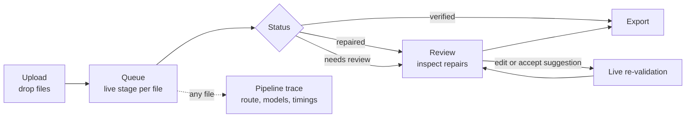

# GSTLens — DESIGN

> The user-facing design: screens, interaction, visual system, microcopy and output formats.
> Files in this set: [ARCHITECTURE](ARCHITECTURE.md) · [IMPLEMENTATION](IMPLEMENTATION.md) · **DESIGN** (this) · [WORKING](WORKING.md)

> [!WARNING]
> Keep these files out of the qualifier repository (**only `README.md` is allowed there**). They are for the final.

---

## 1. Design goals

An evaluator will spend roughly two minutes with the UI. In that time it must make three things obvious:

1. **It accepts anything** — five formats, mixed batches, no configuration.
2. **It is honest** — every value says how sure we are and *why*; flagged values are impossible to miss.
3. **It is fast to correct** — a human fixes a flagged field in seconds, with the source image right beside it.

| Principle | In practice |
|---|---|
| **Show the evidence, not just the answer** | Each field links to its source crop, readers, rules that cross-checked it, and any repair history |
| **Uncertainty is visible, never decorative** | Status is encoded with colour **and** a symbol **and** a word |
| **Don't make the user hunt** | Review opens on the first flagged field; "Next flagged" is one click |
| **Edits are safe** | Every edit re-validates immediately and is tagged `human_edited` |
| **No false drama** | A repaired value is labelled "repaired", with the reason — not hidden, not alarming |

---

## 2. User flow



**Screens:** (1) Upload & Queue · (2) Review · (3) Export (a panel, not a page) · (4) Pipeline trace (a drawer on Review) · (5) Evaluation view (P2).

---

## 3. Screen 1 — Upload & Queue

```
┌────────────────────────────────────────────────────────────────────────────┐
│ GSTLens   Perception proposes. Arithmetic disposes.        ● Local · Offline │
├────────────────────────────────────────────────────────────────────────────┤
│  ┌──────────────────────────────────────────────────────────────────────┐  │
│  │   Drop invoices here or [Browse]      .xlsx  .csv  .pdf  .jpg  .png   │  │
│  └──────────────────────────────────────────────────────────────────────┘  │
│  Batch of 8      ✓ Verified 4    ~ Repaired 2    ! Needs review 1    … 1   │
│                                                      [Export batch ▾]      │
│  ┌──────────────────┬───────────────┬─────────────┬────────────┬─────────┐  │
│  │ File             │ Route         │ Stage       │ Status     │ Flags   │  │
│  ├──────────────────┼───────────────┼─────────────┼────────────┼─────────┤  │
│  │ sales_sep.xlsx   │ Tabular       │ Done        │ ✓ Verified │ –       │  │
│  │ inv_0381.pdf     │ Digital PDF   │ Done        │ ✓ Verified │ 1 warn  │  │
│  │ bill_photo_2.jpg │ Printed image │ Done        │ ~ Repaired │ –       │  │
│  │ hand_0042.jpg    │ Handwritten   │ Repairing 2/2│ …         │ –       │  │
│  │ hand_0043.jpg    │ Handwritten   │ Done        │ ! Review   │ 2       │  │
│  └──────────────────┴───────────────┴─────────────┴────────────┴─────────┘  │
│  Click a row to open Review.                                               │
└────────────────────────────────────────────────────────────────────────────┘
```

| Element | Behaviour |
|---|---|
| Drop zone | Multi-file; validates type by content, shows rejected files with a reason ("Encrypted PDF — remove the password and re-upload") |
| Stage column | `Queued → Routing → Reading → Validating → Repairing n/2 → Done`; updates automatically while any file is pending |
| Status chip | `✓ Verified` · `~ Repaired` · `! Needs review` · `… Processing` — icon + word + colour |
| Flags | Count of unresolved flagged fields + soft warnings |
| Offline badge | Always visible: "Local · Offline" (a real property of the system, not a slogan) |
| Quality banner | If a photo's quality score is low: "This photo is blurry or skewed. Results may need more review — consider retaking it." Processing continues |

**Empty state:** "Drop an invoice to begin. Nothing leaves this machine." **Error state per file:** a red row with the reason and a *Remove* action; the rest of the batch continues.

---

## 4. Screen 2 — Review (the screen that wins or loses the demo)

```
┌ hand_0043.jpg · Handwritten image · ! Needs review · 1 flag · image quality 0.78 ┐
│ [◀ Prev]  [Next flagged ▶]   [Pipeline trace ⓘ]   [Export ▾]                      │
├───────────────────────────────────┬───────────────────────────────────────────────┤
│ SOURCE                [Fit] [+][−]│ RECORD                                        │
│ ┌───────────────────────────────┐ │ Header                                        │
│ │ (page image)                  │ │  Invoice no   INV-2026-1042       ✓ 0.97      │
│ │  ┌────┐ boxes drawn per field │ │  Date         2026-10-04          ✓ 0.95      │
│ │  │ ✓  │ green = verified      │ │  Supplier     Shree Ganesh Traders  unverified│
│ │  └────┘ amber = repaired      │ │  Supplier GSTIN  27ABCPD0234F1ZE  ~ 0.68  ⓘ   │
│ │  ┌────┐ red   = needs review  │ │     repaired: checksum + second reader        │
│ │  │ !  │ selected = blue frame │ │  Buyer GSTIN  27XYZPQ5678K1ZF     ✓ 0.99      │
│ │  └────┘                       │ │ Line items                    [edit cells]    │
│ └───────────────────────────────┘ │  # Description  HSN  Qty  Rate  Taxable  …    │
│ FIELD CROP (selected field)       │  1 Hex bolts    7318  12   450  ~ 5,400  …    │
│ ┌───────────────────────────────┐ │ Totals                                        │
│ │ (zoomed crop of the cell)     │ │  Grand total  13,425            ! 0.63        │
│ └───────────────────────────────┘ │     Rule 7: lines do not add up to the total  │
│ Readers: A "13,425" B "13,425"   │     Suggestion: 13,452 [Accept] [Edit] [Keep]│
├───────────────────────────────────┴───────────────────────────────────────────────┤
│ RULES  11 of 12 passed · 1 hard failure                    [Show all rules ▾]     │
│  ! Rule 7  The line items add up to ₹13,452, but the invoice total reads ₹13,425  │
└───────────────────────────────────────────────────────────────────────────────────┘
```

### 4.1 Interaction model
| Action | Result |
|---|---|
| Select a field (row in the record list) | Source image highlights its box in blue; crop panel shows the zoomed cell; readers' candidates and the rules that involve it appear below |
| ⓘ on a field | Evidence popover: per-reader values, view used (base / upscaled / contrast), rules satisfied/violated, repair history (see §6.3) |
| **Suggestion banner** | Appears when the Solver/Adjudicator has a candidate that satisfies the rules but was *not* perceptually confirmed. Buttons: **Accept** (tags `human_edited`, re-validates), **Edit**, **Keep original** |
| Edit a value | Inline; on commit the record is re-validated and the status, rule panel and chips update at once |
| Next flagged | Jumps to the next red field, then the next amber |
| Rotate page | ⟲ ⟳ buttons re-run preprocessing with the corrected orientation (fallback when auto-orientation fails) |
| Pipeline trace | Drawer: route chosen, per-page digital/scanned decision, models called, number of crop reads, repair rounds, timings |

### 4.2 What a reviewer must be able to answer in 3 seconds
*Is this invoice OK? Which fields are not? Why? What does the paper actually say there?* — status chip (top), red/amber fields (right), rule sentence (bottom), crop (left).

---

## 5. Implementation of the UI in Streamlit (realistic constraints)

Streamlit cannot natively click on regions inside an image, so interactions are **list-driven**, with the image redrawn:

| Need | Approach | Fallback |
|---|---|---|
| Overlays | Pre-render the page with PIL: coloured boxes + symbol badges; selected field in blue; cache per (document, selection) | Render only the selected field's box |
| Select a field | `st.dataframe` with row selection events → store field path in `st.session_state` | `st.selectbox` of fields ("Inspect field") |
| Editable line items | `st.data_editor` | Plain inputs per cell |
| Live re-validation | On edit → `PATCH /documents/{id}/fields/{path}` → refresh record | "Apply" button |
| Auto-refresh of queue | `st.fragment` with a short `run_every` | Manual "Refresh" button |
| Layout | `st.columns` split ~45/55 for source/record; rule panel full width below | — |
| Theme | `.streamlit/config.toml` with the tokens in §6 | — |

*VERIFY@M2:* row-selection events and `run_every` fragments depend on the installed Streamlit version; the fallbacks above keep the design intact if either is missing. A prototype of selection + overlay is built **first** in M2 because it is the riskiest UI element.

---

## 6. Visual system

### 6.1 Status encoding (colour is never the only signal)
| State | Colour | Symbol | Word | Fill (tint) |
|---|---|---|---|---|
| Verified | `#1B7F4B` | ✓ | Verified | `#E6F4EC` |
| Repaired | `#92600A` | ~ | Repaired | `#FDF3DC` |
| Needs review | `#C0262D` | ! | Needs review | `#FBE5E6` |
| Unverified (Tier C) | `#5A6472` | – | Unverified | `#EEF0F3` |
| Selected / info | `#1F5FAE` | ◉ | — | — |
| Text | `#1A202C` | | | |

All status colours on white (and white on the status colour) measure **≥ 5.0:1** contrast; ink on every tint measures **≥ 13:1**, so text passes WCAG AA. Boxes on the source image use a **3 px outline plus a symbol badge** in the corner, so they remain distinguishable for colour-blind users and on grey photos.

### 6.2 Confidence chip
`[symbol] 0.68` — the number is the heuristic score from ARCHITECTURE §7, shown to two decimals; the band decides colour (≥ 0.85 green, 0.60–0.85 amber, < 0.60 red), except that a field involved in an unresolved hard-rule failure is always red. Tooltip: *"Confidence is a heuristic score from reader agreement, rule checks and image quality — not a probability."*

### 6.3 Evidence popover (per field)
```
Supplier GSTIN                       ~ Repaired · 0.68
Crop  [ image ]
Readers
  paddle_vl   27ABCPDO234F1ZE   (base view)
  qwen_vl     27ABCPDO234F1ZE   (base view)
  qwen_vl     27ABCPD0234F1ZE   (altered view: upscaled, contrast)
Rules
  ✓ R1 format   ✓ R2 checksum   ✓ R3 state matches place of supply
Repair history
  Round 1: R1 and R2 failed on the first reading (letter "O" where a digit is required)
           → one checksum-valid neighbour ("0") → confirmed by an altered-view re-read
```

### 6.4 Typography and spacing
Streamlit's default sans-serif for UI; **monospace** for GSTINs, invoice numbers and amounts (so `0`/`O` and `1`/`I` are distinguishable); amounts right-aligned with Indian digit grouping (1,00,000.00); base spacing unit 8 px.

---

## 7. Output design

### 7.1 JSON
**Full** (`*.full.json`): the `InvoiceRecord` — every field with `value`, `tier`, `confidence`, `provenance`, `bbox`, `candidates`, `evidence`; `validation` (all rule results); `status`; `warnings`; `meta` (config versions, model names, timestamp). **Flat** (`*.json`): values, status and flags only, for downstream systems:

```json
{
  "document_id": "d-0043",
  "status": "needs_review",
  "invoice": { "invoice_number": "INV-2026-1042", "invoice_date": "2026-10-04",
               "supplier": { "name": "Shree Ganesh Traders", "gstin": "27ABCPD0234F1ZE" },
               "totals": { "taxable": "11400.00", "cgst": "1026.00", "sgst": "1026.00", "grand_total": "13425.00" } },
  "flags": [ { "field": "totals.grand_total", "rule": 7, "suggestion": "13452.00" } ]
}
```
*(Synthetic data; money serialised as strings to avoid float rounding.)*

### 7.2 CSV (batch export = zip)
| File | One row per | Key columns |
|---|---|---|
| `invoices.csv` | Invoice | document_id, source_file, source_type, status, invoice_number, invoice_date, supplier_name, supplier_gstin, buyer_name, buyer_gstin, place_of_supply, taxable, cgst, sgst, igst, cess, round_off, grand_total, flag_count, warning_count |
| `line_items.csv` | Line item | document_id, line_no, description, hsn_sac, qty, unit, rate, taxable_value, cgst_rate, cgst_amt, sgst_rate, sgst_amt, igst_rate, igst_amt, line_total |

### 7.3 XLSX (one workbook)
| Sheet | Content |
|---|---|
| `Invoices` | As `invoices.csv`, with status cells coloured by the §6.1 tints |
| `LineItems` | As `line_items.csv` |
| `Validation` | document_id, rule_id, rule_name, severity, passed, fields, message |
| `ReviewQueue` | document_id, field, current value, confidence, reason, suggestion |
| `FieldAudit` | document_id, field, final value, provenance, confidence, evidence |
| `Meta` | Run time, model names/versions, config versions (slabs/states/tolerances) |

Money columns are numeric cells with Indian-style number formatting; GSTIN and HSN columns are **text** (leading zeros preserved).

---

## 8. Microcopy

### 8.1 Rule messages (plain language, shown in the rule panel)
| # | Message template |
|---|---|
| 1 | "The GSTIN **{value}** is not in the valid 15-character format." |
| 2 | "The GSTIN **{value}** fails its check digit — one character is probably misread." |
| 3 | "The GSTIN starts with state code {a}, but the invoice shows {b}." *(warning)* |
| 4 | "This is an intra-state sale, so CGST and SGST should be equal and IGST zero." / "This is an inter-state sale, so only IGST applies." |
| 5 | "Quantity × rate gives ₹{x}, but the taxable value reads ₹{y}." |
| 6 | "{rate}% of ₹{taxable} is ₹{x}, but the tax amount reads ₹{y}." |
| 7 | "The line items add up to ₹{x}, but the invoice total reads ₹{y}." |
| 8 | "{rate}% is not a standard GST rate for an invoice dated {date}." *(warning)* |
| 9 | "The HSN/SAC code should be 4, 6 or 8 digits (6 for services)." *(warning)* |
| 10 | "The invoice date is missing, unreadable, or in the future." |
| 11 | "Invoice numbers can be at most 16 characters: letters, numbers, - or /." *(warning)* |
| 12 | "The amount in words says ₹{x}, but the figures say ₹{y}." *(warning)* |

### 8.2 Status and system messages
| Situation | Text |
|---|---|
| Verified | "All checks passed." |
| Repaired | "{n} value(s) were corrected automatically and re-checked. Review the amber fields." |
| Needs review | "{n} value(s) could not be confirmed. The paper may be unclear, or the invoice may contain an error." |
| Suggestion | "These figures would satisfy all checks, but they were not confirmed from the image. Please compare with the paper." |
| Tier C | "Unverified — names and addresses have no automatic check." |
| Model offline | "The reading model is not responding. Digital PDFs and spreadsheets still work; image reading is paused." |
| Replay mode (only if ever used) | "REPLAY — showing pre-computed results for this demo file." *(persistent banner)* |

---

## 9. Accessibility and robustness
- Status never relies on colour alone (symbol + word + tint); contrast ≥ AA (§6.1).
- All actions reachable by keyboard through Streamlit's native widgets; image overlays have a text equivalent (the field list).
- Large images are downscaled for display; the full-resolution crop is always available in the crop panel.
- Layout verified at a 1366×768 laptop screen — the likely demo display — before any polish.

---

## 10. Design decisions

| Decision | Reason |
|---|---|
| Review screen is the product; upload is a thin front door | Evaluators judge trust and correctability, not upload widgets |
| Suggestions require one human click | Prevents wrong-but-consistent values from becoming silent |
| Confidence shown as a number *and* a band, with an honest tooltip | Numbers invite scrutiny; the tooltip prevents over-reading them |
| Pipeline trace available but tucked away | Proves engineering depth without cluttering the primary task |
| Monospace for identifiers and amounts | Handwriting-style confusions (`0/O`, `1/I`) are the main error source |
