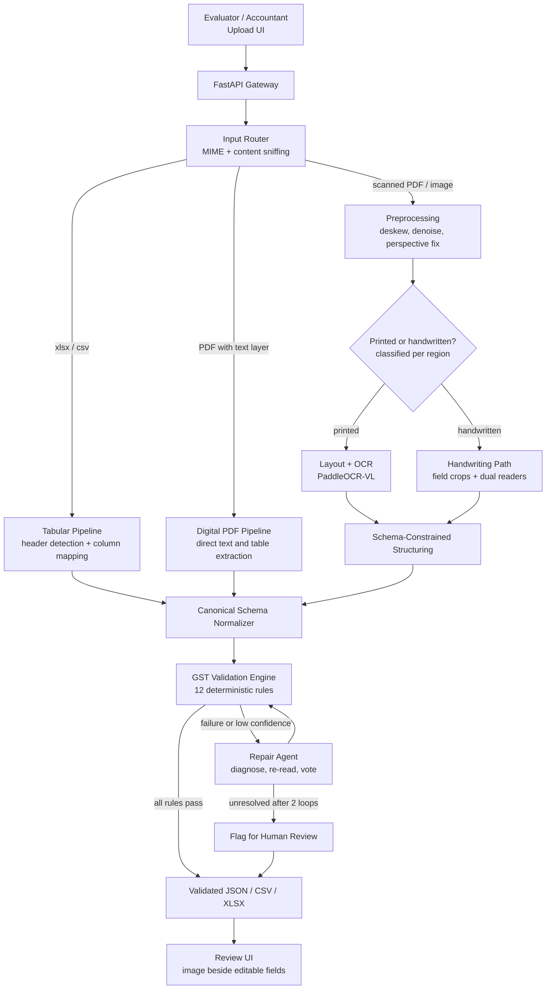
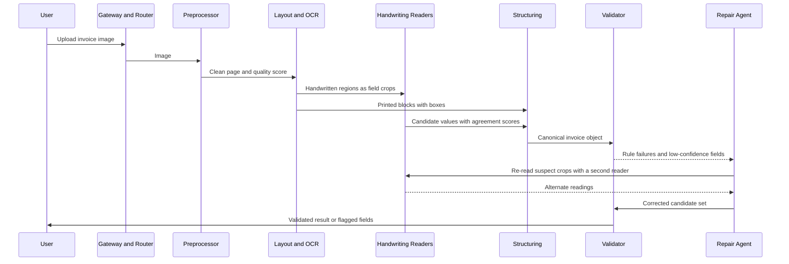
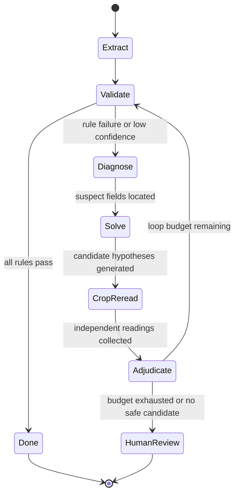

# GSTLens

### *Perception proposes. Arithmetic disposes.*

**Hacktober Fest — Open Source AI Hackathon (Elevate)** · **Track 3 — VYOM+ End-to-End AI-Powered GST Invoice Intelligence System** · *Qualifier (README-only proposal)*

> **Team:** `[Astra_X]` · `[Bishal Dey]` · `[Miheer Kulkarni]` · `[Wrichik Pau]` · **Planned license:** Apache-2.0

---

## The thesis :

Most invoice-AI demos run OCR, pass the text to an LLM and print JSON. That works on a clean PDF but **fails silently on a handwritten invoice**, where a model may confidently write `5,490` for `5,400`. In accounting, a confident wrong number is worse than a missing one. GSTLens is built on four ideas:

1. **Open-source models are *perception*.** They read pixels and propose values; they are never trusted alone.
2. **GST law and arithmetic are *truth*.** An invoice is a system of equations and format rules (GSTIN checksum, `taxable × rate = tax`, `CGST = SGST`, `Σ lines = totals`) that cannot hallucinate.
3. **Rule failures are *signals*.** A broken rule shows *which* field is likely wrong, so only that region is re-read by a second reader and re-validated.
4. **What cannot be proven is flagged, never guessed.** We optimize for a low *silent* error rate, not just high accuracy.

The answer to handwritten invoices isn't a bigger model; it's a **closed verification loop around small, open, locally-run models.**

| A wrapper does… | GSTLens does… |
|---|---|
| One model call per file | A **router** picks the cheapest reliable path per document *and per region* |
| Trusts model output | **12 deterministic GST rules** audit every field and relationship |
| Returns whatever it got | **Constraint-guided repair**: failed rules localize suspect cells, re-read by a different reader |
| Single model, hosted API | **Multi-model ensemble, 100% local**; no invoice leaves the machine |
| JSON dump | **Review UI**: source image beside editable fields, colour-coded confidence, JSON/CSV/XLSX export |

---

## 1. Project Name

**GSTLens** — a verification-first, open-source pipeline that turns any GST invoice (digital, printed or handwritten) into validated, machine-readable records. **Inputs:** `.xlsx`, `.csv`, `.pdf`, `.jpg/.jpeg`, `.png`. **Outputs:** JSON, CSV/XLSX, per-field confidence, validation report. **Inference:** fully local, open-weight models only.

## 2. Problem Statement

Indian businesses produce GST invoices as ERP exports, Excel sheets, digital PDFs, scans, phone photos and **handwritten bill-book invoices**. Downstream accounting (VYOM+ vouchers, GST filing) needs **exact, structured records**, but existing tools break in three ways:

1. **Handwriting:** generic OCR degrades on amounts, GSTINs and quantities, where one wrong digit changes a tax liability.
2. **Silent errors:** LLM extractors return fluent, plausible, *unchecked* numbers.
3. **Fragmentation:** tools handle spreadsheets *or* images *or* PDFs, leaving accountants to stitch and fix by hand.

**GSTLens accepts any supported format, extracts invoice/GST/tax/line-item data, *proves* what is correct, repairs what is not, flags what remains uncertain, and exports records an accounting system can trust**, with handwriting as the main battleground and no regression on printed/digital inputs.

## 3. Project Overview

A **router-based pipeline with a validation-driven self-correction loop.** Each file is typed and sent down the cheapest reliable path; open-source OCR/VLMs extract fields into a strict schema; a **deterministic GST validation engine** audits everything; failed or low-confidence fields trigger a **targeted repair loop** (crop → re-read with a second reader → re-validate). Anything still unproven after two loops goes to a human in the review UI with the source image alongside.

## 4. Proposed Solution

```
   ROUTE  →  PERCEIVE  →  STRUCTURE  →  VALIDATE  →  REPAIR
                                 ▲                      │
                                 └──────────────────────┘   (max 2 loops, then human review)
```

| Stage | What happens | Intelligence from |
|---|---|---|
| **Route** | Identify input type; classify printed vs handwritten *per region* | Heuristics + text-layer detection |
| **Perceive** | Layout, OCR, table recovery; crop-level handwriting reads | Open-source VLMs |
| **Structure** | Raw reads → canonical Pydantic schema (schema-constrained decoding) | Open-source LLM/VLM |
| **Validate** | 12 deterministic rules; per-field confidence | Pure Python, no AI |
| **Repair** | Suspect fields → re-read crops with another reader → vote → re-validate | Agent loop + constraint reasoning |
| **Deliver** | Validated JSON/CSV/XLSX + inspect-and-correct UI | FastAPI + Streamlit |

**The novel mechanism, in one example.** A handwritten line reads `qty 12`, `rate 450`, `taxable 5,490`, `CGST 9% = 486`:

| Check | Result |
|---|---|
| `qty × rate` = 12 × 450 = **5,400** | ≠ taxable 5,490 ✗ |
| `taxable × 9%` = 494.1 | ≠ CGST 486 ✗ |
| `486 ÷ 0.09` = **5,400** | agrees with `qty × rate` ✓ |

Two independent equations converge on 5,400, so the outlier is the *taxable value*. The agent crops only that cell, re-reads it on a second model with a digit-only prompt, and confirms `5,400`. **No model had to be smarter; the invoice's own math located the error.** The same idea drives GSTIN checksum search and the amount-in-words cross-check.

## 5. Objectives

| # | Objective | Success measure |
|---|---|---|
| O1 | Accept all five formats through one entry point | All formats yield schema-valid output |
| O2 | Auto-route each document to the most reliable pipeline | Router accuracy; digital PDFs never touch OCR |
| O3 | Extract invoice, party, GST, tax and line items into one schema | Field-level exact match by class |
| O4 | **Minimize silent errors** | **Silent Error Rate** per document type |
| O5 | **Improve handwritten reliability** via guided repair | Pass rate/accuracy before vs after repair |
| O6 | No regression on printed/digital | Reported separately |
| O7 | Evaluator-friendly upload → review → export | Working UI flow |
| O8 | Fully offline, commodity hardware | No external calls; single consumer GPU; CPU mode for digital/tabular |

## 6. Target Users / Use Case

| User | Pain today | What GSTLens gives |
|---|---|---|
| **SME accountants / CA firms** | Hours of manual entry from mixed-format, often handwritten invoices | Review only *flagged* fields; audit trail of what was verified |
| **VYOM+ (downstream)** | Needs clean records to auto-create vouchers | Standardized, validated JSON/tabular output |
| **Traders / small suppliers** | Bill-book invoices invisible to digital tools | Digitization with confidence scoring |
| **Hackathon evaluators** | Need to test real documents and inspect results | Upload → side-by-side view → export |

**Journey:** upload mixed files → automatic route/extract/validate/repair → results marked ✅ *verified*, 🟡 *repaired*, 🔴 *needs review* → flagged invoices open with image beside editable fields and the failing rule highlighted → export.

## 7. Open-Source AI Technology Selected

All models run locally behind a small `Reader` interface, so any model can be swapped without touching the pipeline.

| Role | Primary choice | Alternates (final-day bake-off) | Used for |
|---|---|---|---|
| **Layout + OCR** | **PaddleOCR-VL family** (~0.9B) | Docling, dots.ocr | Reading order, tables, printed text with boxes |
| **Handwriting reader** | **Qwen-VL family** (Qwen3-VL class, quantized 4B–8B) | olmOCR, smaller Qwen-VL | Cropped handwritten fields (digits, names, GSTINs) |
| **Structuring** | Same local VLM/LLM, **schema-constrained decoding** | Gemma / Llama-class | Raw reads → canonical JSON; ambiguous Excel headers |
| **Serving** | **vLLM** (guided decoding) or **Ollama** (structured outputs) | llama.cpp | Local, reproducible serving |

> Exact checkpoints, licenses and VRAM needs are confirmed on Hugging Face at kickoff; *only models we have actually run are claimed.*

## 8. Why This Technology Was Selected

- **PaddleOCR-VL (printed/scanned):** a compact document-parsing VLM with layout analysis and table recovery. Invoices are table-heavy, and a purpose-built parser beats a general chat VLM on tables and reading order at a fraction of the compute. *Rejected:* Tesseract-style OCR (no layout intelligence); a large VLM for everything (slow, hallucination-prone on dense numerics).
- **Qwen-VL class (handwriting):** used on **cropped regions, never whole pages**; handles varied handwriting and tight instructions ("digits only"), and cropping shrinks the hallucination surface. *Crop localization:* layout finds header, party block, item table and totals; printed labels (GSTIN, Qty, Rate, CGST…) anchor handwritten value cells; table geometry is the fallback. *Rejected:* whole-page reads (invented content) and classical handwriting engines (weak on messy bill-book writing). Its output is only trusted *after verification*.
- **Schema-constrained decoding (vLLM/Ollama + Pydantic):** malformed output is eliminated by construction. *Rejected:* free-form generation plus regex repair (brittle).
- **Why open source is the right fit, not just allowed:** **privacy** (GSTINs, pricing and supplier data never leave the machine), **offline use**, **zero per-page cost** for firms processing thousands of invoices, **control** (guided decoding, crop prompting, model swapping) and **auditability** (deterministic rules + local models = reproducible).

## 9. AI's Role in the System

| | **AI (open-source models)** | **Deterministic rules (no AI)** |
|---|---|---|
| **Job** | *Perception and structuring*: read pixels, recover layout, transcribe handwriting, map messy headers | *Truth and verification*: GSTIN checksum, tax math, totals, tax-type logic, formats |
| **Strength / weakness** | Handles variability / can be confidently wrong | Cannot hallucinate / cannot read an image |
| **Trust** | **Proposes** values | **Decides** if a value is acceptable |

Without AI the system cannot read a photographed invoice; without rules it reads fluently and wrongly. **Confidence is earned, not self-reported:** it combines reader agreement, model confidence signals where available, image quality and *validation evidence* (a value confirmed by a satisfied equation or checksum scores higher than one that merely looks right).

## 10. System Architecture



A PDF with a valid text layer is extracted directly (more reliable than OCR). Images are split by *region* because real invoices are hybrids (printed pad, handwritten fill). Every path converges on **one canonical schema**, so validation, repair and UI are written once. The repair loop is capped at two iterations to bound latency.

## 11. Component-Level Architecture

| Component | Responsibility |
|---|---|
| **Input Router** | Detect file type and pipeline; check PDF text layer (OCR on digital PDFs wastes time and loses accuracy) |
| **Preprocessor** | Deskew, denoise, contrast, perspective fix; outputs a quality score (phone photos are the worst case) |
| **Region Classifier** | Label regions printed vs handwritten, since pre-printed pads need different readers per region |
| **Layout + OCR Module** | Reading order, tables, printed text with boxes; backbone of line-item extraction |
| **Handwriting Module** | Field-level crop reads with dual independent readers; shrinks hallucination to one cell |
| **Structuring Module** | Raw reads → schema-valid JSON via constrained decoding |
| **Tabular Mapper** | Header detection, column mapping, type coercion (₹, separators, dates), multiple invoices per sheet |
| **Normalizer** | Unifies all paths into the canonical schema |
| **GST Validation Engine** | 12 rules, per-field verdicts and confidence (the truth oracle) |
| **Repair Agent** | Diagnose → re-read crops → vote → re-validate |
| **Exporter / Review UI** | JSON, CSV, XLSX with validation metadata; upload, side-by-side inspect, correct, export |
| **Config Store** | Versioned GST slabs, state codes, tolerances, prompts (rules change; code shouldn't) |

## 12. Data / Information Flow

### 12.1 Handwritten or scanned image (the hard path)

We never assume a whole invoice is handwritten. The layout pass finds header, party block, item table and totals; printed labels (GSTIN, Qty, Rate, Taxable, CGST, SGST) anchor nearby cells, and the value region beside each label becomes the crop for the handwriting reader. If an anchor is missing, table geometry is the fallback. Critical numerics and GSTINs are always read twice before the repair loop decides whether to trust them.



### 12.2 Processing steps per input type

| Input | Steps |
|---|---|
| **Excel / CSV** | Detect sheet and header row → deterministic header matching (LLM only for ambiguous columns) → coerce types → split invoices → normalize → validate → export |
| **Digital PDF** | Confirm text layer → extract text/tables directly (no OCR) → structure → normalize → validate → export |
| **Scanned PDF / printed image** | Rasterize + preprocess → layout + OCR → structure → normalize → validate → repair if needed → export |
| **Handwritten image** | Preprocess → layout + region classification → printed regions via OCR, handwritten as **field crops** → two independent reads per critical field (digit-only prompts) → agreement scoring → structure → validate → repair (≤2 loops) → flag unresolved → export |


### 12.3 The GST Validation Engine

| # | Rule | Logic | On failure |
|---|---|---|---|
| 1 | **GSTIN format** | 15 chars: state code + PAN block + entity digit + `Z` + check char | Re-read crop |
| 2 | **GSTIN checksum** | Weighted mod-36 over first 14 chars | Enumerate OCR confusions (`0↔O`, `1↔I`, `5↔S`, `8↔B`, `2↔Z`); keep only candidates passing checksum *and* state rule |
| 3 | **State ↔ GSTIN** | First two digits match state / place of supply | Flag |
| 4 | **Tax-type logic** | Intra-state → CGST + SGST (equal; UTGST for UTs); inter-state → IGST | Flag / re-derive |
| 5 | **Line math** | `qty × rate − discount ≈ taxable` | Re-read numeric cells |
| 6 | **Tax math** | `taxable × rate = tax` (±₹1) | Solve for the outlier of the three; re-read it |
| 7 | **Sum consistency** | Σ lines = totals; totals + round-off = grand total | Locate offending line |
| 8 | **Rate sanity** | Rate in slab set **for the invoice date** | Flag |
| 9 | **HSN/SAC format** | Numeric, 4/6/8 digits (SAC 6) | Flag |
| 10 | **Date sanity** | Parseable, not future, plausible FY | Re-read |
| 11 | **Invoice number** | ≤16 chars, alphanumeric with `-` or `/` | Flag |
| 12 | **Amount in words** | Compare with figures when present; best tie-breaker for handwritten totals | Re-read, then flag |

**Date-aware slabs.** GST slabs changed in 2025, so invoices before and after legitimately carry different rates. Slabs are a **versioned config keyed by invoice date** (re-verified before the final); a naive validator would wrongly reject valid older invoices.

**Constraint-guided repair.** For a failing equation set, the agent proposes the *minimal set of cells to change* that satisfies all rules, drawing on reader alternates, OCR confusion sets and values implied by other equations, then re-reads only those crops to **confirm perceptually**. Arithmetic proposes, pixels confirm; math alone never overwrites a value.

## 13. Agentic Workflow



The orchestrator is an **explicit, typed state machine**, not a free-roaming LLM agent: deterministic control flow, models invoked only where perception is needed, so latency is bounded and every decision auditable. Its tools: **Diagnoser** (maps failed rules to suspect fields), **Solver** (candidate set from implied values, confusion sets and reader alternates, no model call), **CropReader** (re-reads with a different reader/prompt/view), **Adjudicator** (accepts a candidate only if rule-consistent *and* supported by the pixels) and **Exporter**.

**Escalation ladder (cheapest evidence first):** **L0** deterministic hypotheses from equations/checksums/confusion sets (free) → **L1** re-read the crop with a *different-architecture* reader → **L2** re-read an *altered view* (upscale, contrast, padding) → **L3** human review with failing rule, crop and candidates shown.

**Reader diversity, not independence.** Two VLMs can make the *same* mistake on the same smudge, so agreement is **not** proof. Readers are decorrelated by model, prompt ("digits only" vs "transcribe exactly") and image view. **Rules outrank agreement.**

| Readers | Rule check | Decision | Label |
|---|---|---|---|
| Agree | Passes | Accept | High · *verified* |
| Agree | **Fails** | Suspected common-mode error → Solver; accept only if a reader/altered view supports the candidate, else flag | Low · *needs review* |
| Disagree | One candidate passes all affected rules | Accept it | Medium · *repaired* |
| Disagree | None passes | Next ladder level, else flag | Low · *needs review* |

**Verifiability tiers (honest scoping).** **A: provable** (GSTIN, tax amounts, taxable values, totals): full repair loop, counted in Silent Error Rate. **B: partially checkable** (dates, HSN/SAC, invoice number, rates): rule checks plus reader agreement, also counted. **C: unverifiable** (names, addresses, descriptions): reader agreement only, labelled *unverified*, never claimed as proven.

**Loop policy:** max **2** iterations plus a per-invoice cap on crop reads, touching only suspect crops. **Evidence trail:** every repaired field stores which rule failed, candidates considered, which readers supported what, and which rule confirmed it, shown per field in the UI.

## 14. Technology Stack

| Layer | Technology |
|---|---|
| **Frontend / Backend** | Streamlit review UI · FastAPI + async workers · typed Python state machine |
| **AI** | PaddleOCR-VL (layout, tables, printed OCR) · Qwen-VL class quantized (handwriting, structuring) · vLLM / Ollama guided decoding · Pydantic |
| **Vision / PDF / tabular** | OpenCV, Pillow · pypdfium2, pdfplumber · pandas, openpyxl, RapidFuzz |
| **Validation** | Pure Python + versioned YAML/JSON config (rules, slabs, state codes) |
| **Infra / Eval** | Docker Compose · Python harness + synthetic invoice generator |

One command brings up model server, API and UI, fully offline on a single consumer GPU; a CPU mode covers digital-PDF and tabular paths.

## 15. Expected Features

- **P0 (guaranteed demo):** upload UI for all five formats · router with text-layer detection · digital PDF and printed-image paths · **minimal handwriting slice** (crop reads + validation for GSTIN and key numerics) · constrained structuring · rules **1, 2, 4, 5, 6, 7** · JSON/CSV export
- **P1 (differentiator):** Excel/CSV mapper with LLM-assisted headers · **full handwriting path** (region classification, crops, dual readers) · colour-coded per-field confidence · **repair loop** · remaining rules (3, 8, 9, 10, 11) with date-aware slabs
- **P2 (stretch):** amount-in-words rule (12) · voting dashboard · edit-and-save · batch queue · evaluation dashboard · offline e-invoice QR decoding as extra ground truth
- **Non-goals:** model training (no dataset provided) · government-portal GSTIN/IRN checks (needs network) · regional-script handwriting · voucher classification (Track 4; noted as downstream bridge)

## 16. Implementation Approach

**Always-shippable build:** the system runs end-to-end from the first hours (with a mock reader if needed) and later phases only add accuracy; we cut from the bottom of the priority list, never the middle. Nominal **10-hour** window, scaled to the actual final. In the first 30 minutes we freeze four contracts (schema, `Reader` interface, rule interface, API shape) so validator, UI and exporters are built in parallel before any model serves.

| Milestone | Time | What is built | Demo-safe state |
|---|---|---|---|
| **M0** Bake-off + contracts | 0:00–0:45 | Run candidate readers on test set; lock model pair | Models chosen |
| **M1** Skeleton | 0:45–2:30 | Router, schema, API + UI shell, config, rules 1/2/4/5/6/7 on mock reader | Upload → validate → export |
| **M2** Digital + printed live | 2:30–4:00 | Real models on digital and printed paths | **Checkpoint 1: demo-safe** |
| **M3** Minimal handwriting | 4:00–5:30 | Template-first crops for GSTIN/key numerics + validation | **Gate G2** |
| **M4** Repair loop + breadth | 5:30–7:30 | Solver, CropReader, Adjudicator, remaining rules, Excel/CSV mapper | **Checkpoint 2: differentiator live** |
| **M5** Measure and fix | 7:30–8:45 | Eval harness + ablation; fix top failures | Real before/after numbers |
| **M6** Freeze + rehearse | 8:45–10:00 | **Feature freeze 8:45**; clean-machine run; backup recording | Submission-ready |

**Handwriting de-risking:** (1) *template-first* on the one or two most common bill-book layouts using printed-label anchors → (2) *generalize* via layout and table geometry → (3) *fallback:* read the whole table region, run full validation, flag what cannot be proven. The demo states plainly where the system falls back to flag-and-review.

**Gates:** **G1** (end M0) model pair runs on target hardware, else smaller quantized variants · **G2** (end M3) critical-field read rate workable, else shift to *validate-and-flag* with repair limited to L0–L1 · **G3** (8:45) clean run works, else freeze and cut from the demo. **Cut order:** Docker packaging → eval dashboard → batch upload → voting dashboard → QR decoding → LLM header mapping → ladder L2. **Never cut:** end-to-end flow, validation engine, review UI, minimal handwriting path, measured results.

**Preparation (no code in the qualifier repo):** smoke-test models and VRAM; build a **test set with ground truth by construction** (team-written handwritten invoices across writers, pens and photo conditions, plus digital/printed/spreadsheet samples); **adversarial invoices** (inconsistent math, invalid GSTINs) to prove the system *flags* rather than silently fixes; **synthetic GSTINs** with computed check characters. **Ownership:** AI/OCR lead · Validation lead · Backend lead · Frontend/Eval lead, each with a backup.

**Evaluation.** Metrics: field-level exact match, numeric accuracy (zero tolerance), line-item F1, validation pass rate before vs after repair, **Silent Error Rate** (wrong values that passed *unflagged*, Tier A/B; the key metric), flag precision, and latency per page. **Ablation:** (A) single-pass VLM → (B) + schema constraint → (C) + validation → (D) + repair loop, reported separately for **digital, printed and handwritten**, with targets set from the M0 baseline and shortfalls reported honestly.

## 17. Expected Final Output

1. **Structured data:** schema-valid JSON per invoice plus CSV/XLSX (one row per line item) with validation status.
2. **Review UI:** split view with the source image (suspect fields boxed) beside editable fields, 🟢/🟡/🔴 confidence, the failing rule and repair evidence per field, and one-click export.
3. **Validation report:** rules passed/failed, fields repaired and how.
4. **Evaluation report:** metrics by input type with before/after ablation and Silent Error Rate.
5. **Reproducible deployment:** public GitHub repo (Apache-2.0), Docker Compose one-command start, documented model setup.

## 18. Future Scope / Scalability

**Voucher classification bridge** (extraction → classification → VYOM+ voucher) · **Tally/ERP export** · **distributed queue and replicated model servers** · **GSTR-2B reconciliation** for ITC checks · **offline e-invoice IRN/QR validation** · **fine-tuned handwriting model** trained on GSTLens's own human-corrected records · **Hindi/regional-language invoices** · **active learning** from corrections · **extensibility:** the `Reader` interface and config-driven rules let new models, tax regimes or document types plug in without pipeline changes.

## 19. Open-Source Dependencies / Components

> Licenses are re-verified upstream at kickoff; restrictive licenses are avoided so the final repo can stay Apache-2.0.

| Component | Purpose | License |
|---|---|---|
| PaddleOCR / PaddleOCR-VL | Layout, OCR, tables | Apache-2.0 |
| Qwen-VL family | Handwriting, structuring | Apache-2.0 (confirm per checkpoint) |
| olmOCR / Docling / dots.ocr | Bake-off alternates | Per upstream |
| vLLM · Ollama · Outlines | Serving, guided decoding | Apache-2.0 · MIT · Apache-2.0 |
| Pydantic · FastAPI · Streamlit | Schema, API, UI | MIT · MIT · Apache-2.0 |
| OpenCV · Pillow | Preprocessing, overlays | Apache-2.0 · HPND |
| pypdfium2 · pdfplumber | PDF rasterization, text, tables | Apache-2.0/BSD · MIT |
| pandas · openpyxl · RapidFuzz · python-magic | Tabular, XLSX, header matching, file typing | BSD-3 · MIT · MIT · MIT |
| Docker Compose | Deployment | Apache-2.0 |

*Deliberate exclusion:* PyMuPDF (AGPL) conflicts with Apache-2.0, so pypdfium2 + pdfplumber are used.

## 20. Expected Challenges and Mitigation

| # | Challenge | Mitigation |
|---|---|---|
| 1 | **Handwriting variability and hallucination** *(primary risk)* | Crop localization, digit-only prompts, dual readers, rule-guided repair, human-review fallback. **We don't claim handwriting is solved; we claim silent errors are minimized and uncertainty is surfaced** |
| 2 | **GPU limits / latency** | ~1B document model for the bulk; quantized 4B–8B VLM only for handwriting and failures; repair capped at 2 loops; CPU path for digital/tabular |
| 3 | **No training data supplied** | Zero/few-shot prompting plus rules; synthetic and self-written test set; no fine-tuning dependency |
| 4 | **Layout variety; poor phone photos; mixed printed/handwritten pages** | Layout-first, schema-driven extraction; OpenCV preprocessing with quality score and re-upload prompt; per-region routing |
| 5 | **GST slab changes** | Versioned, date-aware config verified before the final |
| 6 | **Model and license drift** | Model-agnostic `Reader` interface; day-of bake-off; claim only what we've run |
| 7 | **Wide scope for one final** | Vertical slices with explicit cut lines; P0 demo-safe by mid-event |
| 8 | **Data privacy** | Fully local inference, zero external API calls, nothing persisted beyond the session by default |
| 9 | **Over-correction by rules** | Rule-proposed fixes need a visual re-read or are flagged; Silent Error Rate is a first-class metric |

## Appendix: Traceability to the Evaluation Rubric

| Rubric criterion | Where answered |
|---|---|
| Clarity of the problem | §2, §6 |
| Originality and relevance | §4 (constraint-guided repair), §12.4 (date-aware slabs) |
| Technical depth of architecture | §10–§13 |
| Open-source AI selection and understanding | §7, §8 |
| Meaningful integration of AI | §9, "not a wrapper" table |
| Feasibility within the final | §15, §16 |
| Completeness | All 20 mandatory sections present |
| Impact, scalability, extensibility | §6, §18 |
| Coherence | One thesis, *perception proposes, arithmetic disposes*, in every section |

---

