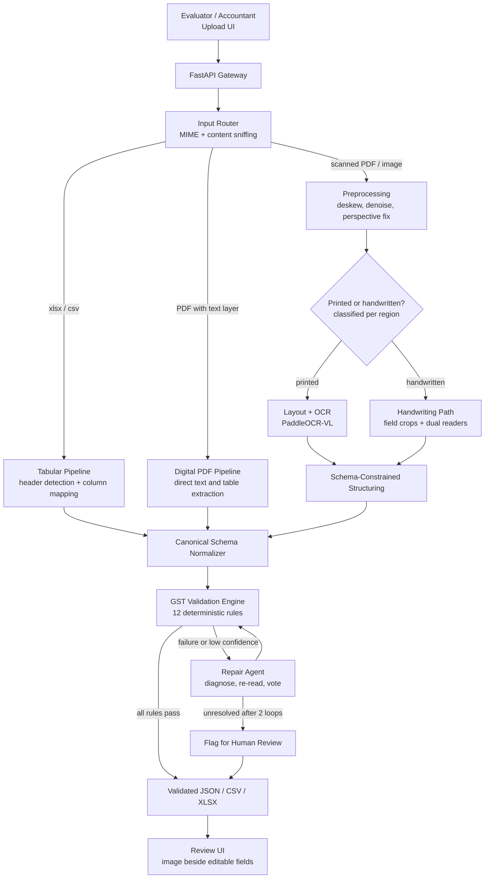
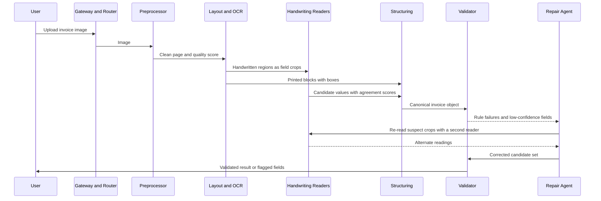
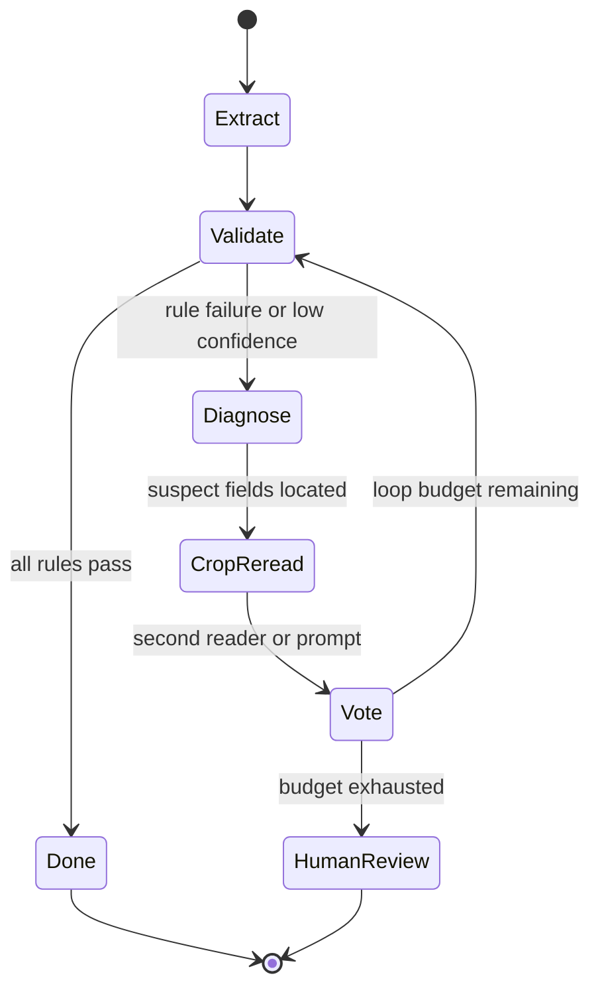

# GSTLens
---

## The thesis in 60 seconds

Many invoice-AI demos follow the same pattern: run OCR, hand the text to an LLM, and print JSON. This can look good on a clean PDF but **can fail silently on a handwritten invoice**, where a model may confidently write `5,490` for `5,400`. In accounting, a confident wrong number is worse than a missing one.

GSTLens is built on a different premise:

1. **Open-source models are *perception*.** They read pixels and propose values. They are never trusted on their own.
2. **GST law and arithmetic are *truth*.** An invoice is a system of equations and format rules (GSTIN checksum, `taxable × rate = tax`, `CGST = SGST`, `Σ lines = totals`). These rules are deterministic, free, and unhallucinatable.
3. **Rule failures are *signals*.** When a rule breaks, the system knows *which* field is probably wrong and re-reads *only that region* with a second reader, then re-validates.
4. **Whatever cannot be proven is flagged, never guessed.** The system is judged on how rarely it is *silently wrong*, not just on how often it is right.

This is how the problem statement's "main technical focus" (reliable document intelligence, especially handwritten GST invoices, without regressing on printed ones) gets solved: not with a bigger model, but with a **closed verification loop around small, open, locally-run models.**

### Why this is not a wrapper

| A wrapper does… | GSTLens does… |
|---|---|
| One model call per file | A **router** that picks the cheapest reliable path per document *and per region* |
| Trusts the model's output | A **12-rule deterministic validation engine** audits every field and relationship |
| Returns whatever it got | **Constraint-guided repair**: failed rules localize suspect cells, which are cropped and re-read by a different reader |
| Single model | **Multi-model ensemble** (document-parsing VLM + general VLM) with agreement-based confidence |
| Hosted API | **100% local inference.** No invoice ever leaves the machine |
| JSON dump | Evaluator-ready **review UI**: source image beside editable fields, colour-coded confidence, JSON/CSV/XLSX export |

---

## Table of Contents

1. [Project Name](#1-project-name)
2. [Problem Statement](#2-problem-statement)
3. [Project Overview](#3-project-overview)
4. [Proposed Solution](#4-proposed-solution)
5. [Objectives](#5-objectives)
6. [Target Users / Use Case](#6-target-users--use-case)
7. [Open-Source AI Technology Selected](#7-open-source-ai-technology-selected)
8. [Why This Technology Was Selected](#8-why-this-technology-was-selected)
9. [AI's Role in the System](#9-ais-role-in-the-system)
10. [System Architecture](#10-system-architecture)
11. [Component-Level Architecture](#11-component-level-architecture)
12. [Data / Information Flow](#12-data--information-flow)
13. [Agentic Workflow](#13-agentic-workflow)
14. [Technology Stack](#14-technology-stack)
15. [Expected Features](#15-expected-features)
16. [Implementation Approach](#16-implementation-approach)
17. [Expected Final Output](#17-expected-final-output)
18. [Future Scope / Scalability](#18-future-scope--scalability)
19. [Open-Source Dependencies / Components](#19-open-source-dependencies--components)
20. [Expected Challenges and Mitigation](#20-expected-challenges-and-mitigation)
21. [Appendix: Traceability to the Evaluation Rubric](#appendix-traceability-to-the-evaluation-rubric)

---

## 1. Project Name

**GSTLens** — *a verification-first, open-source document-intelligence pipeline that turns any GST invoice (digital, printed or handwritten) into validated, machine-readable financial records.*

| Field | Value |
|---|---|
| Track | 3 — VYOM+ End-to-End AI-Powered GST Invoice Intelligence System |
| Core idea | Open-source perception models + deterministic GST validation + targeted repair loop |
| Inputs | `.xlsx`, `.csv`, `.pdf`, `.jpg/.jpeg`, `.png` |
| Outputs | Standardized JSON, structured CSV/XLSX, per-field confidence, validation report |
| Inference | Fully local, open-weight models only |
| License (final repo) | Apache-2.0 |

---

## 2. Problem Statement

Indian businesses generate GST invoices in many forms: ERP exports, Excel sheets, digital PDFs, scanned bills, phone photos of paper invoices, and **handwritten invoices on pre-printed pads**. Downstream accounting (VYOM+ voucher creation, GST filing, reconciliation) needs these as **exact, structured records.**

Existing approaches break in three predictable ways:

1. **Handwriting.** Template OCR and generic extraction tools degrade sharply on handwritten amounts, GSTINs and quantities, the exact fields where one wrong digit changes a tax liability.
2. **Silent errors.** LLM-based extractors return fluent, plausible, *unchecked* numbers. A hallucinated digit is indistinguishable from a correct one without verification.
3. **Fragmentation.** Tools handle either spreadsheets or images or PDFs, so the accountant still stitches pipelines and fixes output by hand.

**The problem GSTLens solves:** *accept any supported invoice format, extract the invoice / GST / tax / line-item data, **prove** what is correct, repair what is not, flag what remains uncertain, and emit standardized records an accounting system can trust — with handwritten invoices as the primary technical battleground and no regression on printed or digital ones.*

---

## 3. Project Overview

GSTLens is a **router-based document-intelligence pipeline** with a **validation-driven self-correction loop**.

Every uploaded file is typed (Excel/CSV, digital PDF, scanned PDF, printed image, handwritten image, or a mix) and sent down the cheapest path that can be reliable for it. Open-source OCR and vision-language models extract fields into a strict, typed JSON schema. A **deterministic GST validation engine** then audits every field and every arithmetic and legal relationship between fields. Failed or low-confidence fields trigger a **targeted repair loop**: the offending region is cropped, re-read by a second, independent reader, and re-validated. Anything still unproven after the loop budget is surfaced to a human in the review UI with the source image alongside, never silently accepted.

The final output is validated JSON plus CSV/XLSX, with per-field confidence and a machine-readable validation report.

---

## 4. Proposed Solution

```
        ┌───────────────────────────────────────────────────────────────┐
        │   ROUTE  →  PERCEIVE  →  STRUCTURE  →  VALIDATE  →  REPAIR    │
        │                                 ▲                      │      │
        │                                 └──────────────────────┘      │
        │                          (max 2 loops, then human review)     │
        └───────────────────────────────────────────────────────────────┘
```

| Stage | What happens | Where intelligence comes from |
|---|---|---|
| **Route** | Identify the input type; for images, classify printed vs handwritten *per region* (pre-printed pads with handwritten fills are the common case) | Heuristics + text-layer detection |
| **Perceive** | Layout analysis, OCR, table recovery; crop-level reading for handwriting | Open-source VLMs |
| **Structure** | Convert raw reads into the canonical Pydantic schema using schema-constrained decoding, so output is always parseable | Open-source LLM/VLM with guided decoding |
| **Validate** | 12 deterministic GST/arithmetic rules; assign per-field confidence | Pure Python, no AI |
| **Repair** | Map rule failures to suspect fields, re-read crops with a different reader, vote, re-validate | Agent loop + constraint reasoning |
| **Deliver** | Validated JSON/CSV/XLSX and an inspect-and-correct UI | FastAPI + Streamlit |

**The novel mechanism, in one example.** A handwritten line reads: `qty 12`, `rate 450`, `taxable 5,490`, `CGST 9% = 486`, `SGST 9% = 486`.

| Check | Result |
|---|---|
| `qty × rate` = 12 × 450 = **5,400** | ≠ taxable (5,490) ✗ |
| `taxable × 9%` = 5,490 × 0.09 = 494.1 | ≠ CGST (486) ✗ |
| `486 ÷ 0.09` = **5,400** | agrees with `qty × rate` ✓ |

Two independent equations converge on 5,400; the single outlier is the *taxable value*. The repair agent crops only that cell, re-reads it with a digit-only prompt on a second model, and confirms `5,400`. **No model had to be "smarter". The invoice's own mathematics located and fixed the error.** The same principle applies to GSTINs (checksum-guided candidate search) and totals (amount-in-words cross-check).

---

## 5. Objectives

Each objective is measurable in the final.

| # | Objective | Success measure |
|---|---|---|
| O1 | Accept all five required formats through a single entry point | `.xlsx`, `.csv`, `.pdf`, `.jpg/.jpeg`, `.png` all produce schema-valid output |
| O2 | Route every document to the most reliable pipeline automatically | Router accuracy on the test set; digital PDFs never touch OCR |
| O3 | Extract invoice, party, GST, tax, financial and line-item data into one canonical schema | Field-level exact match by field class |
| O4 | **Minimize silent errors** (wrong values that pass validation unflagged) | **Silent Error Rate**, reported per document type |
| O5 | **Improve handwritten invoice reliability** via validation-guided repair | Validation pass rate and field accuracy: *before* vs *after* repair loop |
| O6 | Hold printed/digital performance (no regression from the handwriting machinery) | Printed/digital accuracy reported separately and stays high |
| O7 | Provide an evaluator-friendly interface to upload, inspect, correct and export | Working upload → review → export flow |
| O8 | Run fully offline on commodity hardware | No external API calls; target a single consumer GPU for the full path; digital-PDF/tabular paths also support CPU execution |

---

## 6. Target Users / Use Case

| User | Pain today | What GSTLens gives them |
|---|---|---|
| **Accountants / bookkeepers at SMEs** | Hours of manual entry from mixed-format purchase invoices | Drop files in, review only the *flagged* fields |
| **CA / tax-practice firms** | Hundreds of client invoices per filing cycle, many handwritten | Batch-ready structured output with an audit trail of what was verified |
| **VYOM+ (downstream accounting platform)** | Needs clean records to create vouchers automatically | Standardized, validated JSON/tabular output |
| **Traders and small suppliers** | Handwritten bill-book invoices are invisible to digital tooling | A path to digitize them with confidence scoring |
| **Hackathon evaluators** | Need to test with real documents and inspect results | Upload → side-by-side view → colour-coded confidence → export |

**Primary user journey**

1. Upload one or many files (mixed formats are fine).
2. GSTLens routes, extracts, validates and repairs automatically.
3. The user sees a result list: ✅ *verified*, 🟡 *repaired and verified*, 🔴 *needs review*.
4. For flagged invoices the UI shows the **source image next to editable fields**, with the failing rule and the suspect cell highlighted.
5. The user corrects at most a few fields and exports JSON / CSV / XLSX for the accounting system.

---

## 7. Open-Source AI Technology Selected

All models run locally. Roles are decoupled behind a small `Reader` interface so any model can be swapped without touching the pipeline.

| Role | Primary choice | Alternates evaluated in the final-day bake-off | Used for |
|---|---|---|---|
| **Layout + OCR (printed, scanned)** | **PaddleOCR-VL family** (≈0.9B VLM; current 1.5 / 1.6 releases) | Docling, dots.ocr | Reading order, tables, printed text, text spotting with boxes |
| **Handwriting reader** | **Qwen-VL family** (Qwen3-VL class, quantized 4B–8B) | olmOCR, smaller Qwen-VL variants for low VRAM | Cropped handwritten fields: digits, names, GSTINs, descriptions |
| **Structuring** | The same locally-served VLM/LLM using **schema-constrained decoding** | Gemma / Llama-class LLMs | Raw reads → canonical JSON schema |
| **Tabular column mapper** | Same local LLM, invoked *only* for ambiguous headers | Pure fuzzy matching (first resort) | Mapping arbitrary Excel/CSV headers to schema fields |
| **Inference serving** | **vLLM** (guided decoding) or **Ollama** (structured outputs) | llama.cpp | Local, reproducible, offline model serving |

> **Verification policy:** model releases move fast. Exact checkpoints, licenses and VRAM requirements are confirmed on Hugging Face at final-day kickoff, and *only models we have actually run are claimed in the final submission.* The architecture is deliberately model-agnostic for exactly this reason.

---

## 8. Why This Technology Was Selected

The choice is driven by the problem, not by popularity. For each component: **what · why · alternatives rejected · I/O · why open source.**

### 8.1 PaddleOCR-VL (printed and scanned documents)

| | |
|---|---|
| **What** | A compact (~0.9B) document-parsing VLM combining layout analysis with element-level recognition (text, tables, formulas), with text-spotting support in newer releases |
| **Why** | Invoices are table-heavy. A purpose-built document parser recovers tables and reading order far more reliably than a general chat VLM, at a fraction of the compute |
| **Rejected** | *Plain Tesseract-style OCR:* no layout intelligence, weak on tables. *Large general VLM for everything:* slower, more VRAM, and more hallucination-prone on dense numeric tables |
| **I/O** | Input: page image → Output: structured blocks (type, text, bounding box, reading order) |
| **Why open** | Small enough to run on modest GPUs; permissively licensed; no per-page cost |

### 8.2 Qwen-VL class general VLM (handwriting)

| | |
|---|---|
| **What** | A general-purpose open-weight vision-language model, used on **cropped regions**, not whole pages |
| **Why** | Handwriting is the hard case. General VLMs can handle varied writing and follow tight instructions ("return digits only"). Cropping limits the task to one field at a time and reduces the hallucination surface |
| **How crops are located** | Layout parsing first identifies major regions such as the header, party block, item table and totals. Printed labels and nearby text anchors are used to associate handwritten cells with canonical fields. When labels are weak or handwritten, table geometry and relative position provide a fallback. |
| **Rejected** | *Whole-page handwriting reads:* context overload and invented content. *Classical handwriting-recognition engines:* weaker on mixed-script, messy bill-book writing |
| **I/O** | Input: field crop + field-specific prompt → Output: constrained string/number; confidence metadata is used only where the selected model/serving stack exposes it |
| **Why open** | Quantized variants are intended to fit on a single consumer GPU; and critically, **the model is only trusted after verification**, so the system does not depend on a perfect handwriting reader |

### 8.3 Schema-constrained structuring (vLLM guided decoding / Ollama structured outputs / Outlines + Pydantic)

| | |
|---|---|
| **What** | Decoding constrained to the canonical JSON schema |
| **Why** | Eliminates malformed output *by construction* and removes an entire class of parsing failures |
| **Rejected** | *Free-form generation + regex repair:* brittle |
| **I/O** | Input: raw reads + layout → Output: schema-valid JSON |
| **Why open** | Constrained decoding is a feature of open serving stacks, and it is *not* available in the same form from many hosted APIs |

### 8.4 Why open source is the correct choice for this domain, not just an allowed one

| Reason | Impact |
|---|---|
| **Data privacy** | Invoices contain GSTINs, supplier relationships and pricing. Local inference means zero data egress |
| **Offline operation** | Works without internet at an accountant's desk or in the evaluation venue |
| **Cost at scale** | Zero marginal cost per page: critical for CA firms processing thousands of invoices |
| **Control** | Guided decoding, crop-level prompting, and model swapping are all possible only with open weights |
| **Auditability** | Deterministic validation plus local models gives a fully reproducible pipeline |

---

## 9. AI's Role in the System

The split between AI and rules is explicit and is the heart of the design.

| | **AI (open-source models)** | **Deterministic rules (no AI)** |
|---|---|---|
| **Responsibility** | *Perception and structuring* | *Truth and verification* |
| **Does** | Read pixels, recover layout, transcribe handwriting, map messy headers, structure text into schema | Check GSTIN checksum, tax arithmetic, totals, tax-type logic, date and format sanity |
| **Strength** | Handles variability no template can | Cannot hallucinate; always right about arithmetic |
| **Weakness** | Can be confidently wrong | Cannot read an image |
| **Trust level** | **Proposes** values with confidence | **Decides** whether a value is acceptable |

**Without AI**, the system cannot read a photographed handwritten invoice at all. **Without rules**, it reads fluently and wrongly. Removing either collapses the product. That interdependence is what makes AI *necessary* here rather than decorative.

**Confidence is earned, not self-reported.** Per-field confidence combines: (a) agreement between independent readers, (b) model/reader confidence signals where available, (c) image quality, and (d) *validation evidence* (a value confirmed by a satisfied equation or a passing checksum scores higher than one that merely "looks right"). Token-level log-probabilities are optional and used only when supported by the chosen model/serving stack.

---

## 10. System Architecture



**How to read it.** The router is the first intelligence decision: when a PDF has a valid embedded text layer, direct extraction is preferred because it is generally more reliable than re-running OCR. Image inputs are preprocessed and then split by *region* because real invoices are hybrids (printed pad, handwritten fill). Every path converges on a single **canonical schema**, so the validation engine, repair agent and UI are written once and work for every input type. The repair loop is bounded at two iterations to protect latency.

---

## 11. Component-Level Architecture

| Component | Responsibility | Input → Output | Interacts with | Why it exists |
|---|---|---|---|---|
| **Input Router** | Detect file type and the right pipeline; check for a PDF text layer | File → pipeline selection | Gateway, all pipelines | Sending a digital PDF through OCR wastes time and *loses* accuracy |
| **Preprocessor** | Deskew, denoise, contrast normalization, perspective correction, rasterization | Raw image/PDF page → clean page image + quality score | Router, OCR/handwriting | Phone-photographed invoices are the realistic worst case |
| **Region Classifier** | Label regions as printed or handwritten | Page + layout blocks → typed regions | Preprocessor, OCR, handwriting path | Pre-printed pads with handwritten fills need different readers per region |
| **Layout + OCR Module** | Reading order, tables, printed text with bounding boxes | Page image → structured blocks | Region Classifier, Structuring | Table recovery is the backbone of line-item extraction |
| **Handwriting Module** | Field-level crop reading with dual independent readers | Crops + field-specific prompts → candidate values + agreement score | Layout, Voter | Shrinks hallucination to one cell; enables voting |
| **Structuring Module** | Raw reads → schema-valid JSON via constrained decoding | Blocks/crops → canonical invoice object | OCR/handwriting, Normalizer | Guarantees parseable output |
| **Tabular Mapper** | Header detection, column mapping, type coercion (₹, separators, dates) | Sheet → canonical invoice objects | Normalizer | Real exports have inconsistent headers, merged cells, multiple invoices per sheet |
| **Canonical Normalizer** | Unify all paths into one schema | Any pipeline output → canonical object | Validation | Write the rules and UI once |
| **GST Validation Engine** | 12 deterministic rules, per-field verdicts | Canonical object → validation report + confidence | Repair Agent, UI | The truth oracle |
| **Repair Agent** | Diagnose failures, re-read crops, vote, re-validate | Failed report + source crops → corrected fields or review flag | Validation, Handwriting | Turns rule failures into targeted corrections |
| **Exporter** | JSON, CSV, XLSX with validation metadata | Validated object → files | UI, API | Machine-readable output for VYOM+ |
| **Review UI** | Upload, side-by-side inspect, correct, export | User actions ↔ API | Gateway | Evaluators must be able to "upload and inspect" |
| **Config Store** | GST slab tables, state codes, tolerances, prompts | Versioned config files | Validation, Structuring | Rules change; code should not |

---

## 12. Data / Information Flow

### 12.1 Handwritten or scanned image (the hard path)

**Handwriting localization strategy.** We do not assume the whole invoice is handwritten. The layout pass first identifies the header, party block, line-item table and totals area. Within those regions, printed labels and nearby text anchors (such as GSTIN, Qty, Rate, Taxable Value, CGST and SGST) are associated with nearby cells. For pre-printed pads with handwritten values, the blank/value region next to each label becomes the crop sent to the handwriting reader. If an anchor is missing or itself handwritten, table geometry and relative position are used as the fallback. Critical numeric fields and GSTINs are re-read independently before the repair loop decides whether they can be trusted.



### 12.2 Step-numbered flow per input type

| Input | Steps |
|---|---|
| **Excel / CSV** | 1. Detect sheets and header row → 2. Deterministic header matching, LLM only for ambiguous columns → 3. Coerce types (dates, ₹, separators) → 4. Split multiple invoices per sheet → 5. Normalize to schema → 6. Validate → 7. Export |
| **Digital PDF** | 1. Confirm text layer → 2. Extract text and tables directly (no OCR) → 3. Structure with constrained decoding → 4. Normalize → 5. Validate → 6. Export |
| **Scanned PDF / printed image** | 1. Rasterize and preprocess → 2. Layout + OCR → 3. Structure → 4. Normalize → 5. Validate → 6. Repair loop if needed → 7. Export |
| **Handwritten image** | 1. Preprocess → 2. Layout and region classification → 3. Printed regions via OCR; handwritten regions as **field crops** → 4. Two independent readings per critical field (digit-only prompts for numerics) → 5. Agreement scoring → 6. Structure → 7. Validate → 8. Constraint-guided repair (≤2 loops) → 9. Flag unresolved → 10. Export |

### 12.3 Canonical output schema (trimmed)

```json
{
  "document_id": "uuid",
  "source_type": "handwritten_image",
  "invoice": {
    "invoice_number": "INV-2026-1042",
    "invoice_date": "2026-10-04",
    "supplier": { "name": "", "gstin": "", "address": "", "state_code": "27" },
    "buyer": { "name": "", "gstin": "", "address": "", "state_code": "27" },
    "place_of_supply": "27",
    "line_items": [
      { "description": "", "hsn_sac": "", "qty": 0, "unit": "", "rate": 0,
        "taxable_value": 0, "cgst_rate": 0, "cgst_amt": 0,
        "sgst_rate": 0, "sgst_amt": 0, "igst_rate": 0, "igst_amt": 0,
        "line_total": 0 }
    ],
    "totals": { "taxable": 0, "cgst": 0, "sgst": 0, "igst": 0, "cess": 0,
                "round_off": 0, "grand_total": 0 }
  },
  "field_confidence": { "invoice_number": 0.97, "supplier.gstin": 0.62 },
  "validation": { "passed": false,
                  "errors": [ { "rule": "GSTIN_CHECKSUM", "field": "supplier.gstin" } ] },
  "needs_review": ["supplier.gstin"]
}
```

### 12.4 The GST Validation Engine (specification)

| # | Rule | Logic | On failure |
|---|---|---|---|
| 1 | **GSTIN format** | 15 characters: 2-digit state code + PAN-pattern block + entity digit + `Z` + check character | Re-read GSTIN crop |
| 2 | **GSTIN checksum** | Weighted modulo-36 check character over the first 14 characters | Re-read; enumerate single-character OCR confusions (`0↔O`, `1↔I`, `5↔S`, `8↔B`, `2↔Z`) and keep only candidates that satisfy the checksum *and* the state-code rule |
| 3 | **State code ↔ GSTIN** | GSTIN's first two digits match the stated state / place of supply | Flag |
| 4 | **Tax-type logic** | Intra-state → CGST + SGST (equal) (UTGST for Union Territories); inter-state → IGST only | Flag or re-derive |
| 5 | **Line math** | `qty × rate − discount ≈ taxable value` | Re-read numeric cells |
| 6 | **Tax math** | `taxable × rate = tax amount` (tolerance ₹1) | Solve for the outlier among the three values; re-read that crop |
| 7 | **Sum consistency** | Σ line items = totals; totals + round-off = grand total | Locate offending line |
| 8 | **Rate sanity** | Rate must belong to the allowed slab set **for the invoice date** | Flag |
| 9 | **HSN/SAC format** | Numeric, 4/6/8 digits (SAC 6 digits) | Flag |
| 10 | **Date sanity** | Parseable, not in the future, plausible financial year | Re-read |
| 11 | **Invoice number** | ≤16 characters, alphanumeric with `-` or `/` | Flag |
| 12 | **Amount in words vs figures** | If present, compare: the strongest tie-breaker for handwritten totals | Re-read, then flag |

**Date-aware slab logic.** GST slab structure changed in 2025, so invoices dated before and after the change legitimately carry different rates. Slabs are therefore a **versioned config keyed by invoice date**, not hard-coded constants, and are re-verified against current notifications before the final. A naive validator would wrongly reject valid older invoices.

**Constraint-guided repair.** For a failing equation set, the agent proposes the *minimal set of cells to change* that makes all rules pass, drawing candidates from (a) each reader's alternate hypotheses, (b) OCR confusion sets, and (c) values *implied* by the other equations. It then re-reads only the suspect crops to **confirm perceptually**: the arithmetic proposes, the pixels confirm. Values are never "corrected" by math alone without visual agreement or an explicit flag.

---

## 13. Agentic Workflow



The orchestrator is an **explicit, typed state machine** (not a free-roaming LLM agent): deterministic control flow, with models invoked as tools where perception is needed. This keeps latency bounded, behaviour reproducible and every decision auditable.

| Agent / Tool | Role | Input → Output |
|---|---|---|
| **Diagnoser** | Maps failed rules to suspect fields; for arithmetic failures, identifies the most likely outlier from the remaining equations | Validation report → ranked suspect-field list |
| **CropReader** | Crops a field by bounding box and re-reads it with a *different* reader or prompt (digit-only for numerics) | Field + box → alternate readings with confidence |
| **Voter** | Combines readings by reader agreement, available model confidence signals and **rule-satisfaction score** | Candidate set → winning value + confidence |
| **Exporter** | Writes validated or flagged output | Final object → JSON / CSV / XLSX |

**Loop policy:** maximum **2** repair iterations per invoice; each iteration re-reads only suspect crops (never the full page). Unresolved fields are handed to human review with the failing rule attached.

---

## 14. Technology Stack

| Layer | Technology | Purpose |
|---|---|---|
| **Frontend** | Streamlit | Upload, side-by-side image/field review, editable table, export |
| **Backend** | FastAPI + async workers | Routing, orchestration, job handling |
| **Orchestration** | Typed Python state machine | Deterministic repair loop |
| **Document AI** | PaddleOCR-VL family | Layout, tables, printed OCR, text spotting |
| **Handwriting / Structuring AI** | Qwen-VL class model (quantized; exact checkpoint locked at kickoff) | Crop-level reading, schema-constrained structuring |
| **Constrained decoding** | vLLM guided decoding or Ollama structured outputs; Pydantic | Schema-valid JSON by construction |
| **Computer vision** | OpenCV, Pillow | Deskew, denoise, perspective, cropping, overlays |
| **PDF handling** | pypdfium2, pdfplumber | Text-layer detection, rasterization, table text |
| **Tabular** | pandas, openpyxl, RapidFuzz | Header detection, deterministic matching, export |
| **Validation** | Pure Python + versioned YAML/JSON config | Rules, slab tables, state codes |
| **Serving / Infra** | Ollama or vLLM; Docker Compose | Reproducible local deployment |
| **Evaluation** | Python harness + synthetic invoice generator | Metrics and ablation reporting |

**Deployment / execution strategy:** one command brings up the model server, API and UI via Docker Compose. The target is fully offline execution on a single consumer GPU machine for the complete path. A CPU mode exists for the digital-PDF and tabular paths, which need no GPU.

---

## 15. Expected Features

### P0 — MVP (guaranteed demo)

- Upload UI accepting all five formats
- Input router with text-layer detection
- Digital PDF path and printed-image path
- **Minimal handwriting slice:** one handwritten invoice path covering critical numeric fields and GSTIN with crop-based reading and validation
- Canonical JSON schema with schema-constrained structuring
- Validation rules **1, 2, 4, 5, 6, 7** (GSTIN format/checksum, tax-type logic, line math, tax math, sums)
- JSON and CSV export

### P1 — Core (the differentiator)

- Excel/CSV mapper with LLM-assisted header mapping
- **Full handwriting path** with region classification, field crops and dual readers
- Per-field confidence display with colour coding
- **Repair loop** (diagnose → crop re-read → vote → re-validate)
- Remaining rules (3, 8, 9, 10, 11), including date-aware slab logic

### P2 — Stretch

- Cross-model voting dashboard and amount-in-words rule (12)
- Human-in-the-loop edit-and-save in the review UI
- Batch upload with a job queue
- Evaluation dashboard (before/after repair)
- Offline decoding of e-invoice QR payloads (where present) as an additional ground-truth cross-check

### Explicit non-goals (scoped out, on purpose)

- Training or fine-tuning models (no dataset is provided; we do not depend on one)
- Government-portal verification of GSTINs/IRNs (requires network; GSTLens is offline by design)
- Handwritten regional-script transcription beyond English/numerals in this iteration
- Voucher classification (Track 4): we only note the downstream bridge

---

## 16. Implementation Approach

**Principle: ship a complete vertical slice first, then deepen.** At every phase the system works end-to-end; later phases only make it more accurate. Every phase has a *cut line*: if time runs out, we cut from the bottom, never the middle.

Planned against a nominal **10-hour** build window and scaled proportionally to the actual final duration (to be confirmed with organizers).

| Phase | Time | Deliverable | Cut line |
|---|---|---|---|
| **0. Kickoff and model bake-off** | 0:00–0:45 | Confirm checkpoints/licenses/VRAM; run all candidate readers on a small handwritten test set; lock the model pair | Decide, don't deliberate. Architecture is model-agnostic |
| **1. Skeleton** | 0:45–2:30 | FastAPI + Streamlit shell, router, canonical schema, config store | — |
| **2. Printed/digital slice** | 2:30–4:00 | Digital PDF path + printed image path → structured JSON | — |
| **3. Minimal handwriting slice** | 4:00–5:15 | GSTIN + critical numeric crops → structured JSON | **P0 complete: core handwriting path live** |
| **4. Validation engine** | 5:15–6:30 | Rules 1, 2, 4, 5, 6, 7 first; then remaining rules | — |
| **5. Handwriting + repair** | 6:30–8:30 | Region mapping, dual readers, Diagnoser/CropReader/Voter loop | **P1 complete: differentiator live** |
| **6. Excel/CSV path** | In parallel from phase 4 | Header mapping and normalization | Deterministic matching only if LLM mapping slips |
| **7. Evaluation + polish** | 8:30–10:00 | Run the harness, produce before/after repair numbers, UI polish, demo script | Stretch items only if ahead |

**Suggested ownership** (4-person team; adapt to actual size)

| Owner | Scope |
|---|---|
| **AI / OCR lead** | Model serving, readers, structuring, handwriting path |
| **Validation lead** | Rule engine, slab config, repair logic, confidence model |
| **Backend lead** | Router, preprocessing, tabular path, exporters |
| **Frontend / Eval lead** | Review UI, synthetic test set, evaluation harness, demo |

### Evaluation plan (method fixed now; run in the final)

No labeled dataset is supplied, so we build our own test set: **synthetic invoices** (templated, with handwriting-style fonts and injected noise) plus a **small set of real photographed and handwritten invoices**, all kept outside the qualifier repository.

| Metric | Definition |
|---|---|
| **Field-level exact match** | Per field class: invoice number, date, GSTIN, totals |
| **Numeric accuracy** | Exact match on amounts, zero tolerance |
| **Line-item F1** | Line items matched on description + amount |
| **Validation pass rate** | % of invoices passing all rules **before vs after repair** |
| **Silent Error Rate** | % of wrong values that passed validation *without* being flagged (the metric that matters most) |
| **Flag precision** | % of flagged fields that were genuinely wrong (flags must be useful, not noise) |
| **Latency per page** | Reported per pipeline path |

**Ablation (the proof that the design works):** (A) single-pass VLM → (B) + schema constraint → (C) + validation → (D) + repair loop. Results reported separately for **digital, printed and handwritten**. Targets are set *before* measurement and reported honestly, including where we fall short.

---

## 17. Expected Final Output

**1. Structured data.** Schema-valid JSON per invoice (see 12.3), plus flat CSV/XLSX with one row per line item and invoice-level columns, each carrying validation status.

**2. Review UI.** Evaluators upload documents and inspect results in a split view:

```
┌────────────────────────────────┬─────────────────────────────────────────┐
│  SOURCE DOCUMENT               │  EXTRACTED RECORD                       │
│  ┌──────────────────────────┐  │  Invoice No   INV-2026-1042      🟢 0.97│
│  │  (scanned / photographed │  │  Date         2026-10-04         🟢 0.95│
│  │   invoice with coloured  │  │  Supplier GSTIN  27AAAAA0000A1Z5 🟡 0.71│
│  │   boxes over fields)     │  │     ↳ repaired via checksum + re-read   │
│  │                          │  │  Line 2 taxable  5,400           🟢 0.93│
│  │   [ suspect field ▓▓▓ ]  │  │  Grand total     6,372           🔴 0.48│
│  └──────────────────────────┘  │     ↳ RULE 7: Σ lines ≠ total  [Edit]   │
├────────────────────────────────┴─────────────────────────────────────────┤
│  Validation: 11 / 12 rules passed · 1 field needs review · [Export JSON]  │
└──────────────────────────────────────────────────────────────────────────┘
```

**3. Validation report.** Every invoice ships with which rules passed, which failed, which fields were repaired, and how.

**4. Evaluation report.** The metric table above, split by input type, including the before/after repair ablation and the Silent Error Rate.

**5. Reproducible deployment.** Public GitHub repository (Apache-2.0), Docker Compose one-command start, documented model setup.

---

## 18. Future Scope / Scalability

| Direction | Description |
|---|---|
| **Voucher classification bridge** | GSTLens output is exactly the structured input a voucher classifier needs, completing extraction → classification → voucher creation for VYOM+ |
| **Accounting-system export** | Tally / ERP-ready import formats |
| **Batch and queue scale-out** | Move from async workers to a distributed queue; horizontally scale model-server replicas |
| **GSTR reconciliation** | Match extracted purchase invoices against GSTR-2B for input-tax-credit checks |
| **e-Invoice validation** | Decode and verify IRN/QR payloads offline; use them as ground truth where present |
| **Fine-tuned handwriting model** | Once real validated data accumulates (the validated, human-corrected records GSTLens produces are themselves a training set), fine-tune a lightweight handwriting reader |
| **Multilingual invoices** | Hindi/Devanagari and regional-language invoices |
| **Active learning** | Human corrections feed the confusion sets and confidence calibration |
| **Extensibility** | Reader interface and config-driven rules mean new models, new tax regimes or new document types plug in without pipeline changes |

---

## 19. Open-Source Dependencies / Components

> Licenses are re-verified against upstream repositories at final-day kickoff. Components with restrictive licenses are deliberately avoided so the final repository can stay Apache-2.0.

| Component | Purpose | License (to re-verify) |
|---|---|---|
| PaddleOCR / PaddleOCR-VL | Layout analysis, OCR, tables | Apache-2.0 |
| Qwen-VL family (e.g. Qwen3-VL) | Handwriting reading, structuring | Apache-2.0 (confirm per checkpoint) |
| olmOCR / Docling / dots.ocr | Bake-off alternates | Per upstream |
| vLLM | High-throughput local serving, guided decoding | Apache-2.0 |
| Ollama | Local serving, structured outputs | MIT |
| Outlines (optional) | Schema-constrained generation | Apache-2.0 |
| Pydantic | Schema definition and validation | MIT |
| FastAPI | Backend API | MIT |
| Streamlit | Review UI | Apache-2.0 |
| OpenCV | Image preprocessing | Apache-2.0 |
| Pillow | Image handling and overlays | HPND (permissive) |
| pypdfium2 | PDF rasterization and text layer | Apache-2.0 / BSD |
| pdfplumber | PDF text and table extraction | MIT |
| pandas | Tabular processing | BSD-3-Clause |
| openpyxl | XLSX read/write | MIT |
| RapidFuzz | Deterministic header matching | MIT |
| python-magic | File type detection | MIT |
| Docker / Docker Compose | Reproducible deployment | Apache-2.0 |

*Deliberate exclusion:* PyMuPDF is AGPL-licensed, which conflicts with an Apache-2.0 final repository, so pypdfium2 and pdfplumber are used instead.

---

## 20. Expected Challenges and Mitigation

| # | Challenge | Why it matters | Mitigation |
|---|---|---|---|
| 1 | **Handwriting variability and VLM hallucination** *(the primary risk)* | Handwritten digits and GSTINs are exactly where a confident wrong read costs money | Never trust a single read. Region-aware crop localization, digit-only prompts, dual readers, rule-guided repair, human-review fallback. **We do not claim handwriting is solved; we claim silent errors are minimized and uncertainty is surfaced** |
| 2 | **GPU limits / latency** | Hackathon hardware is modest | ~1B dedicated document model for the bulk; quantized 4B–8B VLM invoked *only* on handwritten regions and failures; repair loop capped at 2; CPU path for digital/tabular |
| 3 | **No training data supplied** | Cannot rely on fine-tuning | Zero/few-shot prompting plus rules; synthetic generator and a small real set for evaluation; no fine-tuning dependency |
| 4 | **Layout variety across suppliers** | Templates differ wildly | Layout-first, schema-driven extraction, not template-driven |
| 5 | **Low-quality phone photos** | Blur, shadows, skew, glare | OpenCV preprocessing, image quality score, explicit re-upload prompt for unreadable inputs |
| 6 | **Mixed printed/handwritten pages** | One reader cannot serve both | Per-region classification and routing |
| 7 | **GST slab / rule changes** | Rates changed recently; hard-coded rules rot | Versioned, date-aware config tables, verified before the final |
| 8 | **Model and license drift** | Open releases move weekly | Model-agnostic `Reader` interface; day-of bake-off; claim only what we have run |
| 9 | **Wide scope for one final** | Risk of a half-built everything | Phased vertical slices with explicit cut lines; P0 demo-safe by mid-event |
| 10 | **Data privacy** | Financial documents are sensitive | Fully local inference, zero external API calls, no data persisted beyond the session by default |
| 11 | **Over-correction by rules** | Math could "fix" a number into a wrong-but-consistent one | Rule-proposed corrections must be confirmed by a visual re-read, or are flagged; Silent Error Rate is tracked as a first-class metric |

---

## Appendix: Traceability to the Evaluation Rubric

| Rubric criterion (Technical Document §6) | Where GSTLens answers it |
|---|---|
| Clarity of the problem | §2, §6 |
| Originality and relevance | §4 (constraint-guided repair), §12.4 (date-aware slab logic) |
| Technical depth of architecture | §10, §11, §12, §13 |
| Appropriate open-source AI selection and understanding | §7, §8 |
| Meaningful integration of AI | §9 (explicit AI/rules split), "Why this is not a wrapper" |
| Feasibility within the final | §15 (tiering), §16 (phased plan with cut lines) |
| Completeness of the proposal | All 20 mandatory sections present |
| Impact, usefulness, scalability, extensibility | §6, §18 |
| Overall coherence | One thesis, *perception proposes, arithmetic disposes*, carried through every section |

---


