# GSTLens — IMPLEMENTATION

> The build plan for the final hackathon: what gets built, in what order, by whom, how it is tested, and when we cut.
> Files in this set: [ARCHITECTURE](ARCHITECTURE.md) · **IMPLEMENTATION** (this) · [DESIGN](DESIGN.md) · [WORKING](WORKING.md)

> [!WARNING]
> The qualifier repository holds **only `README.md`**. These files stay out of it. Nothing below is code that may be committed before the final; items marked *(prep)* are non-code groundwork and only happen **if organizers confirm pre-event preparation is allowed**.

---

## 1. Operating principles

1. **Always shippable.** An end-to-end build (with a mock reader) runs from hour 1; every later step only adds accuracy. We cut from the bottom of the priority list, never the middle.
2. **Contract-first.** In the first 30 minutes we freeze `contracts.py` (field/candidate/rule/reader types), the API shape and the config file formats. After that, four people work in parallel without waiting for models.
3. **Mock reader.** A reader that returns canned, deliberately imperfect candidates lets validation, repair, UI and export be built and tested before any model serves.
4. **Own your directory.** One owner per folder (§3); cross-folder changes are announced, not silently pushed.
5. **Measure, don't assume.** Model speed, VRAM and read accuracy are measured at M0 and again at M5. Numbers in README and slides come only from those runs.
6. **Honest demo.** We show where the system flags instead of fixing. Pre-computed (replay) outputs, if ever used as a safety net, are labelled as such on screen.

---

## 2. Roles

| Role | Owns | Backup |
|---|---|---|
| **A — AI / OCR lead** | Model serving, `readers/`, `layout.py`, `anchors.py`, handwriting path (zones, crops, dual reads), structuring prompts | B |
| **B — Validation lead** | `config/` rule tables, `validate/`, `repair/`, `confidence.py`, `status.py` | A |
| **C — Backend lead** | `router.py`, `preprocess.py`, `tabular/`, `api/`, `export/`, Docker | D |
| **D — Frontend / Eval lead** | `services/ui/`, `eval/` (generator, harness, report), test set, demo script | C |

*With 3 people, C absorbs the UI shell and D's eval harness is shared by B; with 2, scope stops at P0 + the repair loop for GSTIN and tax math, and P2 is dropped entirely.*

---

## 3. Repository layout (final repo, Apache-2.0)

```
gstlens/
├─ README.md  LICENSE  docker-compose.yml  .env.example  pyproject.toml
├─ config/                    # B owns; read-only at runtime
│  ├─ slabs.yaml  states.yaml  tolerances.yaml  anchors.yaml
│  ├─ layout_profiles/        # 1–2 bill-book templates (A)
│  └─ prompts/                # field-typed prompts (A)
├─ gstlens/
│  ├─ contracts.py            # FROZEN at 0:30
│  ├─ router.py  preprocess.py            # C
│  ├─ layout.py  anchors.py               # A
│  ├─ readers/  base.py mock.py paddle.py qwen.py text_layer.py table_cell.py   # A
│  ├─ structure/  table_rows.py free_text.py normalize.py                       # A / C
│  ├─ tabular/  detect_header.py map_columns.py group_invoices.py               # C
│  ├─ validate/  engine.py gstin.py slabs.py rules/ r01 … r12                   # B
│  ├─ repair/  diagnose.py solve.py crop_reader.py adjudicate.py controller.py  # B
│  ├─ confidence.py  status.py                                                  # B
│  ├─ export/  json_csv.py xlsx.py                                              # C
│  └─ api/  main.py jobs.py store.py                                            # C
├─ services/
│  ├─ ocr/   (Paddle wrapper + Dockerfile)                                      # A
│  └─ ui/    (Streamlit app)                                                    # D
├─ eval/     generator/  harness.py  metrics.py  ablation.py  report.py         # D
└─ tests/    test_rules.py test_gstin.py test_solver_props.py test_router.py
             test_normalize.py test_api_smoke.py test_tabular.py
```

---

## 4. Before the final *(prep, only if permitted)*

First, **ask organizers four things**: (1) is pre-event setup allowed (downloads, environment, test data)? (2) final duration; (3) will there be internet during the event (model downloads)? (4) is hardware provided, or do we bring our own?

| Prep task | Owner | Output |
|---|---|---|
| Hardware inventory: who has a GPU, VRAM, OS; test that Ollama runs a small vision model on it | C | One "primary demo machine" chosen, one backup |
| Download candidate weights (Qwen3-VL 4B/8B, PaddleOCR-VL) and confirm licences on Hugging Face | A | Weights on the demo machine and a backup disk |
| **Author the real handwritten set:** print 2 blank bill-book templates; each writer fills 3–6 invoices from a *script* (a JSON sheet of fake supplier/buyer, synthetic GSTINs, line items); photograph in 3 conditions (good light, shadow, angled) | D + all | 15–20 invoices with exact ground truth **by construction** |
| Prepare 20 synthetic GSTINs with computed check characters, plus 10 deliberately invalid ones | B | Test vectors for rules 1–2 |
| Create 6 messy Excel/CSV files (odd headers, merged cells, multiple invoices per sheet, a formula with no cached value, Indian number formats) | C | Tabular test files |
| Pick the 5-document demo set and write the demo script | D | See [WORKING §10](WORKING.md) |

If pre-event coding is **not** allowed, the small utilities (GSTIN generator, generator script) move into M0–M1 and nothing else in the plan changes. All sample data is synthetic: fake firms, synthetic GSTINs, no real business identifiers.

---

## 5. Final-day schedule (nominal 10 h; scale proportionally to the real duration)

```mermaid
gantt
    title Final-day plan, hours from start
    dateFormat HH:mm
    axisFormat %H:%M
    section A - AI and OCR
    Serve models and bake-off          :a1, 00:00, 45m
    Reader adapters and structurer     :a2, 00:45, 105m
    Anchors zones printed path live    :a3, 02:30, 90m
    Handwriting slice crops dual read  :a4, 04:00, 90m
    CropReader row strips logprobs     :a5, 05:30, 120m
    Fix top failures                   :a6, 07:30, 75m
    section B - Validation
    Config tables GSTIN util           :b1, 00:00, 45m
    Rules 1 2 4 5 6 7 and tests        :b2, 00:45, 105m
    Solver prototype and property tests:b3, 02:30, 90m
    Adjudicator confidence status      :b4, 04:00, 90m
    Wire repair rules 3 8 to 12        :b5, 05:30, 120m
    Tune thresholds from eval          :b6, 07:30, 75m
    section C - Backend
    Router API jobs JSON CSV export    :c1, 00:00, 150m
    Preprocess and digital PDF path    :c2, 02:30, 90m
    Excel CSV deterministic mapper     :c3, 04:00, 90m
    LLM header assist and XLSX export  :c4, 05:30, 120m
    Docker Compose and clean run       :c5, 07:30, 75m
    section D - UI and Eval
    Streamlit shell and generator      :d1, 00:00, 150m
    Upload queue field table           :d2, 02:30, 90m
    Review overlay crops chips         :d3, 04:00, 90m
    Live revalidate rule panel         :d4, 05:30, 120m
    Eval harness ablation report       :d5, 07:30, 75m
    section Everyone
    Freeze rehearse record backup      :crit, e1, 08:45, 75m
```



### Milestones, deliverables and "done when"

| Milestone | Window | Deliverable | **Done when** |
|---|---|---|---|
| **M0** Bake-off + contracts | 0:00–0:45 | Both model servers up; contracts frozen; config tables drafted | G1 passed (§9); `contracts.py` merged; mock reader returns candidates |
| **M1** Skeleton | 0:45–2:30 | Router, API, job runner, schema, rules 1/2/4/5/6/7 with tests, UI shell | `upload → mock extract → validate → JSON/CSV` works from the UI |
| **M2** Digital + printed live | 2:30–4:00 | Text-layer path, preprocessing, Paddle reader, structurer, upload/queue UI, deterministic Excel/CSV mapper | **Tag `cp1-demo-safe`**: digital PDF, Excel/CSV, printed image validate end to end on the demo set |
| **M3** Minimal handwriting | 4:00–5:30 | Layout profile for 1–2 templates, anchor→crop, dual reads for GSTIN + amounts, review overlay | **Gate G2** (§9); a handwritten demo invoice shows a flagged or verified GSTIN and amounts |
| **M4** Repair + breadth | 5:30–7:30 | Diagnoser/Solver/CropReader/Adjudicator wired; rules 3, 8–11; LLM-assisted headers; XLSX; live re-validation | **Tag `cp2-differentiator`**: the 5,490 → 5,400 example repairs on a real photo or is honestly flagged with a suggestion |
| **M5** Measure + fix | 7:30–8:45 | Eval run (ablation A–D), top-5 failure fixes, threshold tuning | `eval/report.md` exists with real numbers |
| **M6** Freeze + rehearse | 8:45–10:00 | Feature freeze **8:45**; clean-machine run; demo rehearsal; backup recording | **Gate G3** (§9); tag `final` |

**Merge points:** 15-minute integration windows at 2:30, 4:00, 5:30 and 7:30 (everyone pulls, runs the five-file demo set, fixes what broke). `main` must always start.

---

## 6. Build specifications by owner

### A — AI / OCR
| Item | Spec | Done when |
|---|---|---|
| Model serving | Ollama (default) with Qwen3-VL Instruct 8B or 4B; Paddle service behind `POST /parse` | Health endpoint green; one crop read and one page parse succeed |
| `readers/qwen.py` | Field-typed prompts, schema-constrained `{value, legible}`, per-call timeout, optional log-prob capture | Digits-only prompt returns digits only on 10 crops; abstains on a blank crop |
| `readers/paddle.py` | Page → blocks with boxes, tables as HTML; line boxes where supported | Printed template's anchors found |
| `anchors.py` + `layout.py` | Fuzzy anchor match (similarity threshold tuned at M2); zones; value-cell boxes; ruled-line grid; layout profiles | Crops land on the right cell for both profiled templates |
| Handwriting slice | `hw_score` heuristic; Tier A fields dual-read; row-strip reads for the item table | GSTIN + amounts read for ≥ 80% of demo handwritten invoices *as candidates* (accuracy is measured, not assumed) |
| Prompts in `config/prompts/` | Versioned; no field values ever hard-coded | Diff-reviewable |

### B — Validation
| Item | Spec | Done when |
|---|---|---|
| `validate/gstin.py` | Format, positional character classes, checksum (algorithm in ARCHITECTURE §6), confusion-neighbour search | Test vectors: valid, 1-char error, class violation, state mismatch |
| Rules 1–12 | One file per rule, pure functions, emit `RuleResult` with `fields` and `expected` | ≥ 3 vectors per rule (pass, fail, edge) |
| `validate/engine.py` | Runs all rules, builds field↔rule incidence map, applies config | Deterministic output ordering |
| `repair/solve.py` | Bounded joint enumeration; fewest-changes ordering | **Property test:** on ≥ 500 injected digit errors, outcome is *recovered* or *flagged*; false-repair count reported |
| `repair/adjudicate.py` | Acceptance rule from ARCHITECTURE §4.9; `repair.auto_accept` flag (can be set to suggestion-only) | Matrix cases unit-tested |
| `confidence.py`, `status.py` | Formula and status table from ARCHITECTURE §7 | Worked examples in WORKING §7 reproduce exactly |

### C — Backend
| Item | Spec | Done when |
|---|---|---|
| `router.py` | Magic-byte typing, per-page digital/scanned decision, size/page caps | 12 router test files classified correctly |
| `preprocess.py` | Orientation, deskew (conditional), perspective (conditional), 3 views, quality score q | Phone-photo samples improve visibly; q correlates with blur we introduce |
| `api/` | Endpoints from ARCHITECTURE §8; asyncio worker pool; semaphore per model server; SHA-256 cache; SQLite | Smoke test with mock readers passes |
| `tabular/` | Header detection, unmerge/forward-fill, value profiling, synonym + profile mapping (**deterministic = P0**), LLM assist for leftovers (**P1**), group into invoices, lossless `extra` | 6 messy files map; low-confidence mappings surface for confirmation |
| `export/` | JSON (full), JSON (flat), CSV, XLSX (sheets in DESIGN §7) | Opens cleanly in Excel/LibreOffice |
| Docker | Compose for `ui`, `api`, `ocr`, `llm`; `.env.example` | **Cut first** if late; native run instructions are the fallback |

### D — Frontend / Eval
| Item | Spec | Done when |
|---|---|---|
| Streamlit app | Screens and states in DESIGN | Upload → queue → review → export without a terminal |
| Generator | JSON "script" → rendered printed PNG, digital PDF, handwriting-font PNG with augmentation; adversarial variants | 30+ handwriting-font, 24 printed, 8 digital PDFs produced with exact ground truth |
| Harness | Runs levels A–D, computes metrics, writes `report.md` | One command, reproducible |
| Demo | Script, file set, fallback plan | Rehearsed twice by two different people |

---

## 7. Test set (ground truth by construction)

| Component | Count (target) | Source | Purpose |
|---|---|---|---|
| Printed images (clean + phone-photo augmentations) | ~24 | Generator | Printed path, preprocessing |
| Digital PDFs | ~8 | Generator | Text-layer path |
| Excel/CSV | ~6 | Hand-built messy files | Tabular path |
| Handwriting-font images | ~30 | Generator (OFL handwriting fonts, rotation ±3°, shadow gradient, blur, JPEG artefacts) | Volume for ablation; **easier than real handwriting, so reported separately** |
| **Team-written handwritten** | **15–20** | Authored from scripts on printed templates, phone-photographed | The real battleground |
| **Adversarial** | ~10 | Injected errors: broken GSTIN, wrong line math, wrong tax, wrong total — synthetic *and* a few handwritten with a deliberate arithmetic slip | Proves we flag instead of silently fixing |

Real-world caveat stated up front: ~20 real handwritten invoices from a few writers is a *sanity check*, not a benchmark. Results will be reported with the sample size beside every number.

---

## 8. Testing and evaluation

### 8.1 Automated tests (written alongside the code)
| Area | Tests |
|---|---|
| Rules | ≥ 3 vectors per rule; GSTIN: a publicly documented valid example, our synthetic valid ones, one-character corruptions, class violations |
| Solver / Adjudicator | Property test over ≥ 500 perturbations: result ∈ {recovered, flagged}; any **wrong-but-accepted** repair fails the build |
| Router | Mismatched extension, scanned-PDF-with-hidden-text-layer, encrypted PDF, corrupt file, CSV in a legacy encoding |
| Normalizer | Amounts (`₹5,400/-`, `1,00,000.50`, `(250)`), dates (day-first, 2-digit year, Excel serial), state names → codes |
| Tabular | Merged cells, header not in row 1, formula without cached value, leading-zero HSN |
| API | Smoke test with mock readers: upload → poll → fetch → patch → export |

### 8.2 Ablation (what the report shows)
| Level | What is switched on | Measures |
|---|---|---|
| **A** | Whole page → one VLM call → free-form JSON (the naive baseline) | Baseline accuracy |
| **B** | + schema-constrained decoding | Effect of constraint alone |
| **C** | + routing, preprocessing, crops, dual reads, **validation (flag only)** | Effect of structure + verification |
| **D** | + repair loop (full GSTLens) | Repair lift; false-repair rate |

Every level reports, separately for digital / printed / handwritten: field exact match (by tier), numeric exact match, line-item F1, validation pass rate, **Silent Error Rate**, flag precision and recall, p50/p95 latency per page, and the sample size.

**Silent Error Rate** = wrong Tier A/B field values that were *not flagged* ÷ all Tier A/B fields evaluated, where "not flagged" means: field confidence ≥ 0.60, no failing rule involves it, and the document status is not `needs_review`. Also reported: the share of invoices that are *verified/repaired but contain ≥ 1 wrong Tier A/B value*.

---

## 9. Gates, thresholds and cut lines

| Gate | When | Pass criteria | If it fails |
|---|---|---|---|
| **G1** | End of M0 | Both services answer; GPU memory < 90% with both loaded and an image in flight; Qwen crop read p50 ≲ 8 s. **Model choice rule:** pick 8B only if it beats 4B by ≥ 10 points exact-match on the 20-crop bake-off *and* latency fits | Use 4B; apply the Plan B ladder (ARCHITECTURE §3) |
| **G2** | End of M3 | On team-written handwritten amount crops, exact match ≥ 50% *before* repair | Keep the path, but present handwriting honestly as **flag-heavy**: limit repair to L0–L1, show suggestions rather than auto-accept |
| **G3** | 8:45 | (a) Clean-machine run works; (b) on the adversarial set, **no document ends `verified`/`repaired` with a wrong Tier A value** | If (b) fails: set `repair.auto_accept = false` (suggestion-only mode) and re-run; ship that rather than ship silent errors. Remove anything unfinished from the demo |

**Cut order if behind:** Docker packaging → evaluation dashboard → batch upload → voting dashboard → QR decoding → LLM header mapping → ladder L2.
**Never cut:** end-to-end flow · validation engine · review UI · minimal handwriting path · measured results.

---

## 10. Git and release discipline

- Trunk-based: `main` always starts. Short-lived branches or direct commits with `pull --rebase`.
- Tags: `cp1-demo-safe` (after M2), `cp2-differentiator` (after M4), `final` (after G3). **Demos run from the latest tag, not from HEAD**, until G3.
- No secrets, no real invoices, no model weights in the repo; `.env.example` only.
- Commit messages: `area: what` (e.g. `validate: add GSTIN class check`).

---

## 11. Risk register

| # | Risk | Likelihood | Impact | Early signal | Response |
|---|---|---|---|---|---|
| 1 | Handwriting read rate is poor | **High** | High | G2 numbers | Flag-heavy positioning; suggestions; honest demo |
| 2 | Paddle install/dependency conflict | Medium | Medium | Not serving by 0:30 | Plan B ladder; separate container |
| 3 | VRAM/latency too high with two models | Medium | High | G1 | 4B model; unload between phases; batch one file at a time |
| 4 | Repair produces wrong-but-consistent values | Medium | **Very high** | Property test, adversarial set | Unique-solution + perceptual-confirmation rule; `auto_accept=false` |
| 5 | Anchor/crop localization fails on unseen layouts | **High** | Medium | Crops visibly off-cell | Layout profiles for known templates; whole-table fallback + flag |
| 6 | Streamlit overlay/selection limits | Medium | Low | Prototype at M2 | Field-list selector + crop panel (DESIGN §5) |
| 7 | Scope creep | **High** | High | Behind schedule at any merge point | Cut list above; P2 only after `cp2` |
| 8 | Demo hardware/network failure | Medium | High | — | Backup machine; backup screen recording; offline by design |
| 9 | GST rule/slab inaccuracies | Low | Medium | Disagreement in review | Config-driven, VERIFY@M0, unlisted rates = soft warning |
| 10 | Test-set optimism (fonts easier than real hands) | High | Medium | Large gap font vs real | Report separately; never merge the numbers |

---

## 12. Definition of done

| Tier | Done means |
|---|---|
| **Minimum (demo-safe)** | All five formats accepted; digital, Excel/CSV, printed validate end to end; handwritten GSTIN and amounts read with validation and flags; JSON/CSV export; review UI |
| **Target** | Repair loop with evidence trail; LLM-assisted headers; rules 3, 8–11; ablation on the test set; Silent Error Rate per document type |
| **Stretch** | Amount-in-words rule; edit-and-save with live re-validation; batch queue; evaluation view; Docker one-command start; QR cross-check |

**Final-day closing checklist:** clean-machine run from the tag · README updated to match what was *actually* built (remove anything not built) · LICENSE present · `.env.example` · pinned dependency versions · sample data synthetic only · measured numbers copied from `eval/report.md` with sample sizes · backup screen recording saved · demo script rehearsed.

---

## 13. What we are deliberately **not** claiming

- That handwriting is "solved". We claim silent errors are minimized and uncertainty is surfaced, and we show the numbers.
- That ~20 handwritten invoices from a few writers is a benchmark.
- That the confidence score is a calibrated probability.
- Any speed or VRAM figure we have not measured on the demo machine.
- Coverage of every GST edge case (special rates, composition scheme, reverse charge, multi-invoice pages).
