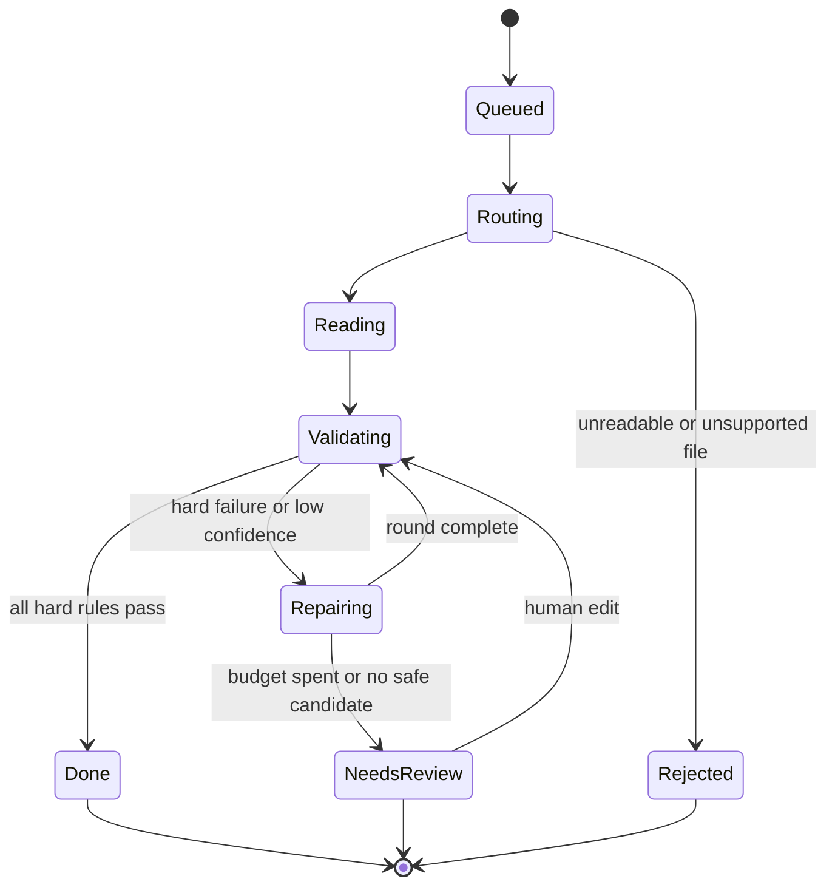
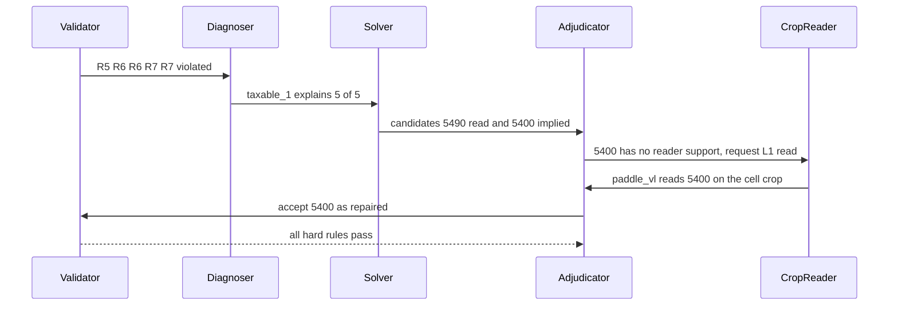

# GSTLens — WORKING

> How GSTLens behaves at runtime, step by step, with worked examples, the demo script and the operating runbook.
> Files in this set: [ARCHITECTURE](ARCHITECTURE.md) · [IMPLEMENTATION](IMPLEMENTATION.md) · [DESIGN](DESIGN.md) · **WORKING** (this)

> [!WARNING]
> Keep these files out of the qualifier repository (**only `README.md` is allowed there**). All names, GSTINs and amounts below are synthetic; the GSTINs carry valid check characters so the examples are internally consistent, but they are not real registrations. Numbers in §9 are **illustrative arithmetic, not results**.

---

## 1. Job lifecycle


`Done` splits into **verified** (nothing was repaired) and **repaired** (≥ 1 field repaired); see ARCHITECTURE §7. A rejected file never stops the rest of the batch.

---

## 2. Routing a mixed batch

| File | What the router sees | Decision |
|---|---|---|
| `sales_sep.xlsx` | ZIP signature with `xl/` entries | Tabular pipeline |
| `vendor_export.csv` | Text; legacy Windows encoding detected; `;` delimiter | Tabular pipeline, decoded correctly |
| `inv_0381.pdf` | ~1,200 text characters; no image covers the page | **Digital** page → text layer, no OCR |
| `scan_0017.pdf` | One image covers ~98% of the page; a hidden OCR text layer exists | **Scanned** page → vision pipeline; the hidden text is kept only as an extra candidate (`text_layer`), not trusted |
| `bill_photo_2.jpg` | Image; quality 0.82; handwriting score low (~8% of value cells) | Vision pipeline, **printed** mode |
| `hand_0042.jpg` | Image; quality 0.78; ~62% of value cells score as handwritten | Vision pipeline, **handwritten** mode (Tier A fields dual-read) |
| `renamed.jpg` (actually a PNG) | Signature says PNG | Re-typed with a UI warning; processed normally |

---

## 3. The five paths

### 3.1 Digital PDF
Text layer → words with exact positions → table detection → column mapping by header synonyms → normalizer → rules. **No model reads pixels**, so values are exact. Consequence for repair: re-reading an exact source cannot help, so the ladder **skips L1/L2**; a failing rule goes straight to *flag with suggestion* (the invoice itself is probably inconsistent). A model is used only if the table cannot be parsed deterministically, or for free-text blocks.

### 3.2 Excel / CSV
```
Source headers         Sample values            Mapped to        How
Inv No.                INV/26/118               invoice_number   synonym
Bill Dt                04/10/26                 invoice_date     synonym + date profile (day-first)
Party GST No           27xyzpq5678k1zf          buyer.gstin      value profile (matches GSTIN shape) → upper-cased
Item                   Hex bolts                description      synonym
HSN                    7318  (read as text)     hsn_sac          synonym; leading zeros kept
Qty / Rate             12 / 450                 qty / rate       synonym
Taxable Amt            5,400/-                  taxable_value    synonym; "/-" and grouping stripped
CGST @9%               486.00                   cgst_amt (9%)    header carries the rate → also fills cgst_rate
Remarks                paid by cheque           extra.Remarks    unmapped → preserved, not dropped
```
Steps: detect the header row → unmerge/forward-fill → profile each column by its values → map (synonyms → value profile → LLM on header + 5 sample values for leftovers) → low-confidence mappings are shown in the UI for one-click confirmation → group rows into invoices (invoice number + supplier) → same canonical schema and rules. Formula cells use cached values; if none exist, the cell is flagged.

### 3.3 Printed scan / photo
Preprocess (orientation, conditional deskew/perspective, quality score) → layout model returns blocks, table HTML, text lines with boxes → anchors and zones found → `paddle_vl` reads everything (cheap-first) → table parsed deterministically → rules. Cells with low printed-OCR confidence or a high handwriting score, and any field that fails a rule, escalate to `qwen_vl` crops.

### 3.4 Handwritten / hybrid image — the full pipeline
1. **Preprocess** → colour, contrast and upscaled views; quality score *q*.
2. **Layout + anchors** → printed labels (`GSTIN`, `Qty`, `Rate`, `Taxable`, `CGST`, …) located by fuzzy match; zones: header, parties, item table, totals, footer. For profiled templates the layout profile pins these exactly.
3. **Value cells** → box right of/below each anchor; table grid from ruled lines (fallback: cluster boxes under header anchors).
4. **Reading** → the item table is read as **row strips** (one constrained call returns all cells of a row); Tier A fields (GSTIN, amounts) additionally get **cell crops** read with a digits-only/GSTIN-typed prompt on a second view. The model may answer `legible: false`; abstentions become empty candidates, never guesses.
5. **Evidence Store** → every reading stored as a `Candidate` with reader, view, box, optional log-probability.
6. **Normalize → validate** → 12 rules; violated rules name their fields and, where possible, the value they would expect.
7. **Repair** (≤ 2 rounds, ≤ 24 crop reads) → §4.
8. **Confidence, status, evidence trail** → §7.
9. **Review UI / export.**

---

## 4. Repair mechanics, shown on one invoice

**The synthetic invoice** — supplier *Shree Ganesh Traders* `27ABCPD0234F1ZE`, buyer `27XYZPQ5678K1ZF`, both Maharashtra (state 27), so CGST + SGST apply.

| # | Item | HSN | Qty | Rate | Taxable | CGST 9% | SGST 9% |
|---|---|---|---|---|---|---|---|
| 1 | Hex bolts | 7318 | 12 | 450 | 5,400 | 486 | 486 |
| 2 | Steel brackets | 7326 | 5 | 1,200 | 6,000 | 540 | 540 |
| | **Totals** | | | | **11,400** | **1,026** | **1,026** |
| | **Grand total** | | | | | | **13,452** |

### 4.1 Case A — one digit misread (`5,400` read as `5,490`)
**Reading:** the row-strip read and the upscaled cell-crop read both say `5,490` (they agree — and are both wrong). Everything else is read correctly.

**Validation** — three hard rules fail (five failed checks), all involving *taxable₁*:

| Rule | Check | Result |
|---|---|---|
| R5 | 12 × 450 = 5,400 vs read 5,490 | ✗ |
| R6 | 9% of 5,490 = 494.10 vs read CGST 486 and SGST 486 | ✗ (both) |
| R7 | Lines 5,490 + 6,000 = 11,490 vs read total taxable 11,400 | ✗ |
| R7 | 11,490 + 2,052 = 13,542 vs read grand total 13,452 | ✗ |

**Diagnoser** — for each field in a violated rule, replace it with the value implied by the other equations and count how many violated checks then pass:

| Candidate suspect | Implied value | Violations explained |
|---|---|---|
| **taxable₁** | **5,400** (from qty × rate) | **5 of 5** (R5, both R6, both R7) |
| cgst₁ | 494.10 | 1, and it *breaks* R4 (CGST ≠ SGST) |
| qty₁ | 12.2 (not an integer) | 1 |
| totals.taxable | 11,490 | 1, and it breaks R6/R5 elsewhere |

**Solver** — candidates for taxable₁: reader alternates {5,490}; implied {5,400}; one-digit confusion neighbours of 5,490 under the seeded pairs (`4↔9` gives 5,440, `5↔6` gives 6,490, …). Only **5,400** satisfies every rule — but **no reader ever produced it**, so it is *unsupported*. At L0 it cannot be accepted.

**Ladder** — L1: `paddle_vl` (a different architecture) re-reads the same cell crop → **`5,400`**. The candidate now has perceptual support.

**Adjudicator** — (1) all hard rules involving the field pass ✓; (2) unique under fewest-changes ordering ✓; (3) supported by a fresh, independent read ✓ → **accepted**, provenance `repaired`.



**Evidence trail stored on the field:** *"R5, R6×2, R7×2 failed with 5,490. Implied value 5,400 satisfied all. Confirmed by paddle_vl re-read of the cell crop."* → shown in the UI popover.

### 4.2 Case B — GSTIN with `0` read as the letter `O`
Both readers return `27ABCPDO234F1ZE`.
- **R1 fails:** position 8 must be a digit; it is a letter. **R2 fails:** the checksum does not match.
- **Solver:** confusion neighbours (`O→0`, `0→O`, `I→1`, `1→I`, `S→5`, `5→S`, `B→8`, `8→B`, `Z→2`, `2→Z`), ≤ 2 substitutions, constrained by the positional character classes. Exactly **one** candidate is class-valid *and* checksum-valid: `27ABCPD0234F1ZE`. (A random wrong string passes the checksum 1 time in 36, which is why class constraints and perceptual support are also required.)
- **No reader produced it** → L2: an *altered view* (upscaled, contrast-normalised, tighter padding) read by `qwen_vl` returns `27ABCPD0234F1ZE` → supported → accepted. R3 also confirms state code 27 = place of supply.

### 4.3 Case C — the paper itself disagrees with the arithmetic (writer's slip)
The grand total is written `13,425` (digits transposed on the paper). Readers agree on `13,425`; R7 fails (lines + tax = 13,452).
- Solver implies **13,452**, but every re-read of the crop (L1, L2) still says `13,425`: **no perceptual support**.
- Decision: **not accepted.** Status `needs_review`; the field shows a *suggestion* (13,452) and the message "These figures would satisfy all checks, but they were not confirmed from the image." The reviewer compares with the paper and decides.
- If the invoice also carries the amount in words (R12, P2) and it reads 13,452, that is shown as extra context — **the paper now contradicts itself, so a human decides**. A consistently read value is never overridden by arithmetic or by words alone.

### 4.4 Case D — the writer made an arithmetic error elsewhere
The CGST on line 1 is written `468` (should be 486). Both readers agree. R6 and R4 (CGST ≠ SGST) fail; the implied value 486 has no perceptual support → **flagged**, with the message that *the invoice itself may contain an error*. This is exactly what the adversarial test set exercises: **a system that "fixes" this silently is worse than one that flags it.**

### 4.5 Case E — an unreadable cell
`qwen_vl` answers `legible: false`. The field stays empty, confidence floors at 0.05, a required-field gap makes the document `needs_review`, and the UI shows the crop with "Could not be read — please enter manually."

---

## 5. Rule semantics at a glance

| # | Rule | Passing example | Failing example |
|---|---|---|---|
| 1 | GSTIN format | `27ABCPD0234F1ZE` | `27ABCPDO234F1ZE` (letter at a digit position) |
| 2 | GSTIN checksum | `27ABCPD0234F1ZE` (check char `E`) | `27ABCPD0234F1ZA` (right shape, wrong check char) |
| 3 | State ↔ GSTIN | GSTIN `27…` with place of supply 27 | GSTIN `27…` with address in state 29 *(warning)* |
| 4 | Tax type | Supplier 27, place of supply 27 → CGST 486 = SGST 486, IGST 0 | Same states but IGST 972 |
| 5 | Line math | 12 × 450 = 5,400 | 12 × 450 vs taxable 5,490 |
| 6 | Tax math | 9% × 5,400 = 486 (±₹1) | 9% × 5,400 vs 468 |
| 7 | Roll-up | 5,400 + 6,000 = 11,400; 11,400 + 2,052 = 13,452 | Total 13,425 |
| 8 | Slab by date | 18% on a 2026 invoice | 28% on a 2026 invoice *(warning)*; 28% on a 2024 invoice passes |
| 9 | HSN/SAC | `7318` | `73` or `73X8` *(warning)* |
| 10 | Date | 2026-10-04 | 2027-10-04 (future) |
| 11 | Invoice no. | `INV-2026-1042` | `INVOICE/2026/OCTOBER/1042` (> 16 chars) *(warning)* |
| 12 | Words vs figures | "Thirteen thousand four hundred fifty-two" = 13,452 | Words say 13,452, figures say 13,425 *(warning)* |

**What the rules cannot catch** (and therefore what the review UI and dual reads are for): errors that are *internally consistent* (e.g. quantity and rate both misread so that the product still matches the misread taxable value), wrong invoice numbers, wrong names/addresses/descriptions (Tier C), and a GSTIN that is well-formed and checksum-valid but belongs to someone else.

---

## 6. Reader behaviour details

| Behaviour | Why |
|---|---|
| Field-typed prompts (`digits`, `amount`, `gstin`, `date`, `text`) with schema-constrained `{value, legible}` | Eliminates malformed output; gives the model a legitimate way to say "I can't read this" |
| Abstain over guess | An empty field is flagged; a plausible guess would not be |
| Format-valid output is **not** evidence of certainty | Constrained decoding forces valid shapes; confidence comes from agreement, log-probs (if exposed) and rules |
| Cheap-first on image pages | The 0.9B document model reads everything; the larger VLM runs only where needed |
| Per-call timeout and per-invoice read cap | Bounded latency; a slow model degrades to *flag*, never hangs |

---

## 7. Confidence and status — worked values

Quality of the photo q = 0.8 → quality penalty = 0.10 × (1 − 0.8) = **0.02**.

| Field | Evidence | Calculation | Score | Band |
|---|---|---|---|---|
| Buyer GSTIN (two readers agree, R1/R2/R3 pass) | agree 0.80 + support 0.30 (capped at 0.25) − 0.02 = 1.03 | clamped to 0.99 | **0.99** | 🟢 |
| Case A taxable₁ (repaired; R5/R6/R7 satisfied) | disputed 0.45 + support 0.21 − 0.02 | | **0.64** | 🟡 |
| Case B supplier GSTIN (repaired; R1/R2/R3 satisfied) | disputed 0.45 + support 0.30 (capped at 0.25) − 0.02 = 0.68 | | **0.68** | 🟡 |
| Case C grand total (agree, R7 violated) | agree 0.80 − 0.15 − 0.02 | | **0.63** → *needs review because R7 is violated and no confirmed repair exists* | 🔴 (unresolved hard failure) |

*(Case C's score sits in the amber band, but a field in an unresolved hard-rule failure is always shown red, and the document status becomes `needs_review`.)*

**Document status for the Case A + B invoice if A and B repair successfully and C is absent:** all hard rules pass, two fields repaired → **🟡 repaired**. With Case C present → **🔴 needs review**.

---

## 8. Evaluation run

`one command` → runs ablation levels **A** (whole page, one VLM call) → **B** (+ schema constraint) → **C** (+ routing, crops, dual reads, validation flag-only) → **D** (+ repair) over the test set, writing `eval/report.md`:

| Per input type · per level | n | Field EM (A / B) | Numeric EM | Line-item F1 | Pass rate before → after repair | **Silent Error Rate** | Flag precision / recall | p50 / p95 latency |
|---|---|---|---|---|---|---|---|---|
| Digital · Printed · Handwriting-font · Team-written handwritten · Adversarial | *measured* | *measured* | *measured* | *measured* | *measured* | *measured* | *measured* | *measured* |

Rows are never merged: easier handwriting-font images do not get averaged with real handwriting. The **sample size is printed beside every number.**

---

## 9. Silent Error Rate — how it is computed (illustrative arithmetic, NOT a result)

Suppose a handwritten set has 10 invoices × 20 Tier A/B fields = **200 fields**, and a level produces 24 wrong values.

| Quantity | Value | Calculation |
|---|---|---|
| Wrong fields flagged (confidence < 0.60, or a failing rule involves them, or doc `needs_review`) | 15 | |
| Wrong fields **not** flagged (silent) | 9 | 24 − 15 |
| **Silent Error Rate** | **4.5%** | 9 ÷ 200 |
| Flag recall | 62.5% | 15 ÷ 24 |
| Flagged fields in total | 30 | |
| Flag precision | 50% | 15 ÷ 30 |

The point of the metric: moving from level C to D should **lower the silent count without raising the false-repair count**. Both are reported; if repair lowers errors by introducing wrong-but-consistent values, the report shows it.

---

## 10. Demo script (≈ 4 minutes)

Five files prepared and tested in advance: `sales_sep.xlsx` · `inv_0381.pdf` · `bill_photo_2.jpg` · `hand_0042.jpg` (Cases A + B) · `hand_0043.jpg` (Cases C/D, deliberate slip).

| Time | Do | Say |
|---|---|---|
| 0:00 | Title screen | "Invoice AI usually fails *silently* on handwriting. GSTLens treats the model as a witness and the invoice's own mathematics as the judge." |
| 0:20 | Drop all 5 files | "Five formats, no configuration. Everything runs locally; nothing leaves this machine." |
| 0:45 | Open the Pipeline trace for one file | "The router chose a different path per file — the PDF with a text layer never touched OCR." |
| 1:15 | Open `hand_0042.jpg`; select the amber taxable cell | "Both readers said 5,490. Three rules broke, all pointing at this cell. Arithmetic proposed 5,400; a *different* reader confirmed it from the pixels. Only then was it accepted — and it is marked *repaired*, with the reason." |
| 2:00 | Open the GSTIN popover | "The letter O instead of zero. One checksum-valid neighbour; confirmed by a re-read of the crop under different contrast." |
| 2:30 | Open `hand_0043.jpg` | "Here the *paper* is wrong — the total is transposed. The system refuses to silently fix it; it shows a suggestion and asks a human." |
| 3:00 | Click **Accept** | "Edits re-validate instantly; status updates; the value is tagged *human-edited*." |
| 3:20 | Export XLSX; show `ReviewQueue` and `FieldAudit` sheets | "Every number has provenance." |
| 3:40 | Show the ablation report | "Single-pass baseline vs full pipeline — Silent Error Rate and false-repair rate, with sample sizes. Handwritten set is small and authored by us; that's stated on the slide." |
| 4:00 | Close | "What we don't claim: handwriting is solved. What we do: wrong numbers don't pass silently." |

**Fallbacks (in order):** (1) backup machine; (2) if the reading model is down, run the digital/Excel files live and show the handwritten files with the **side-by-side crop and the flagged state only**, saying so; (3) the pre-recorded screen capture. Any pre-computed output shown is labelled **REPLAY** on screen. We never present replayed output as live.

### Prepared answers
| Likely question | Honest answer |
|---|---|
| Why not one big model? | Ablation A vs D; a single call cannot say *which* number to distrust |
| What if both readers are wrong and the math still passes? | Constraints cannot catch internally consistent errors; that is why Silent Error Rate is a reported metric, Tier A fields are dual-read, and Tier C is labelled unverified |
| Isn't "repair" just guessing? | A repair needs: all rules pass, a unique solution, and an independent read that shows the same value. Otherwise it is only a suggestion |
| Are those accuracy numbers real? | They come from `eval/report.md`; the handwritten set is ~20 invoices from a few writers; sample sizes are shown |
| What about GST rate changes? | Slabs are a date-keyed config; invoices before and after 22 Sep 2025 are validated against their own era |
| Does it scale? | `api` is stateless; the GPU is the bottleneck; replicated model servers behind a queue is the path — not built today |
| Other languages? | Out of scope for this build |

---

## 11. Runbook

**Start order:** model servers (`llm`, `ocr`) → wait for health → `api` → `ui`. **Before demo:** run the five-file set once to warm the models; confirm `/health` is green; confirm free disk and GPU memory.

| Symptom | Likely cause | Fix |
|---|---|---|
| Model answers slowly or with long reasoning text | A "thinking" Qwen variant was pulled | Use the **Instruct** (non-thinking) variant |
| Out-of-memory / very slow | Two models + large images | Switch to the 4B model; downscale images; one file at a time |
| Every GSTIN fails rule 2 | Checksum implementation error | Run `test_gstin.py` vectors; check the weights alternate 1, 2 and the quotient + remainder sum |
| Overlay boxes offset from fields | Mixing normalised and pixel coordinates, or a resized display image | Convert with the displayed image size at draw time |
| UI never updates the queue | Auto-refresh not supported in the installed Streamlit | Use the manual **Refresh** button (DESIGN §5) |
| Excel dates wrong by month/day | Day-first setting missing | Set the date-order config; cross-check against other dates in the file |
| `api` cannot reach models in Docker | Host networking | Use the compose service name, or the host gateway address for natively running Ollama |
| Handwritten crops land on the wrong cell | Layout profile anchors off | Re-measure the profile on the real photo; fall back to whole-table read + flag |

---

## 12. Limits (stated, not hidden)

- Handwriting accuracy is **measured**, not assumed, and will vary by writer, pen and photo.
- The first build covers 1–2 known bill-book layouts well; unseen layouts fall back to flag-and-review.
- Validation proves *consistency*, not *truth*; Tier C fields (names, addresses, descriptions) carry no oracle.
- One invoice per file (multi-page single invoices supported); no segmentation of invoice bundles.
- English and numerals only; no regional-script handwriting.
- No government-portal verification; no GSTIN existence check (offline by design).
- The confidence score is a heuristic band, not a calibrated probability.
